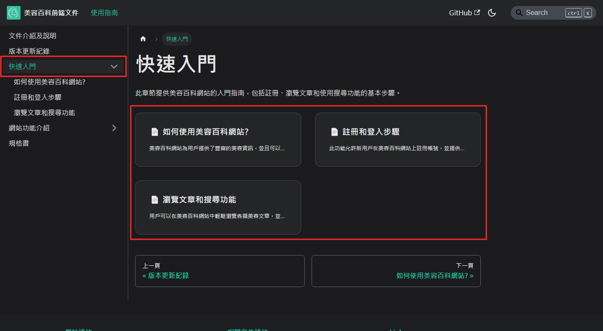
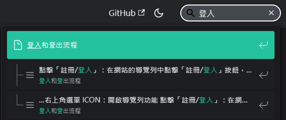
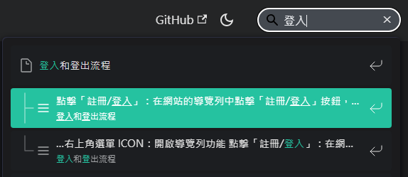
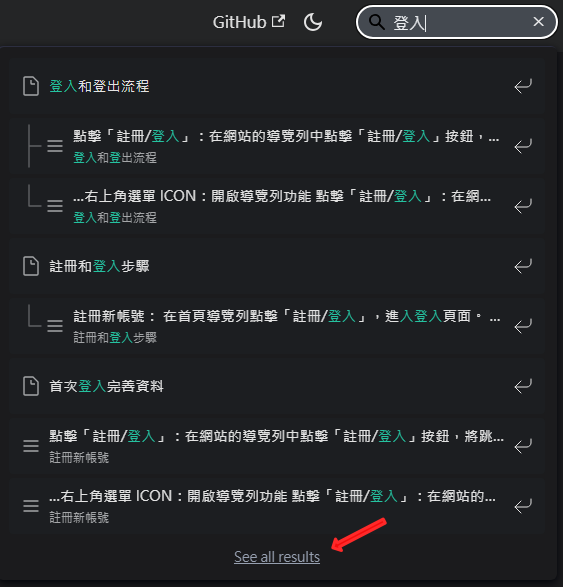

# 文件介紹及說明

本操作文件說明前端網站操作說明，快速說明如何使用到基本功能。

## 依照快速入門或網站功能操作說明

快速入門介紹前端網站常用功能，提供簡易使用步驟，網站功能介紹則是提供更詳細的前端網站功能，有各自使用的流程。

### 1. 選擇快速入門/網站功能介紹

### 2. 展開子選單

點擊箭頭可展開/收合子選單，顯示平台內可設置的功能列表

點擊文字，除了展開功能列表，頁面會列出該平台功能清單

### 3. 選擇需要了解的操作

例如點選　"如何使用美容百科網站?＂

### 4. 閱讀操作說明

就可以看到如何使用美容百科網站的具體流程

## 使用搜索功能

除了按照平台分類找功能外，在任何頁面都可以使用右上角搜尋功能直接輸入要搜索的內容。

### 1. 使用搜尋功能

### 2. 輸入搜索文字

輸入後會看看到下方選單出現即時搜索結果

### 3. 選取項目

可直接從搜索結果的選單內用方向鍵/滑鼠選取

### 4. 檢視全部搜索結果

點擊下方連結可跳至全部搜索結果

