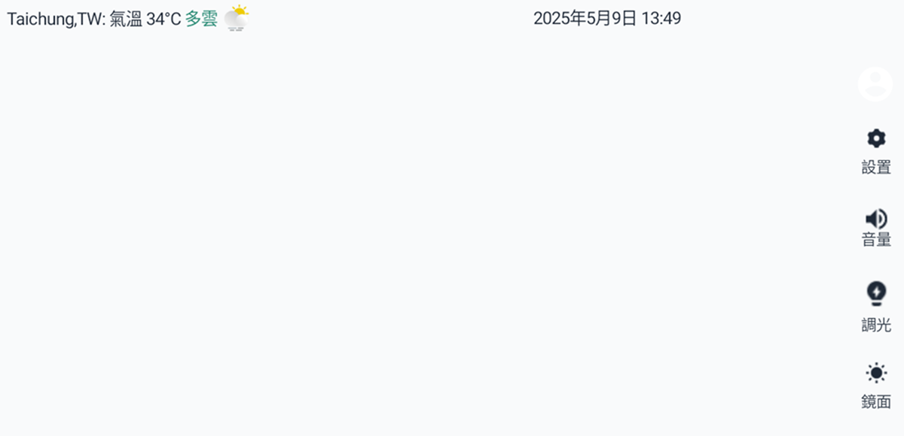
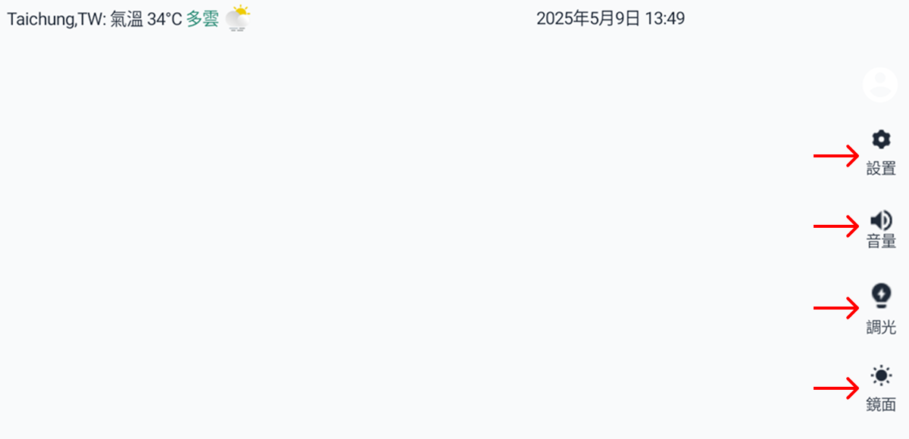
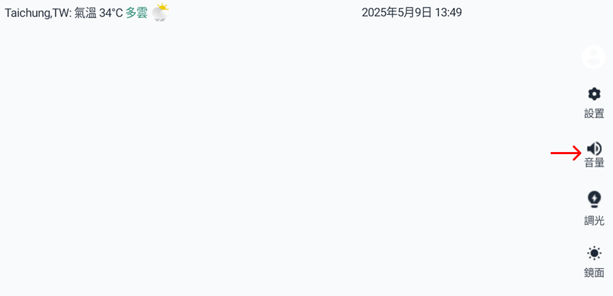
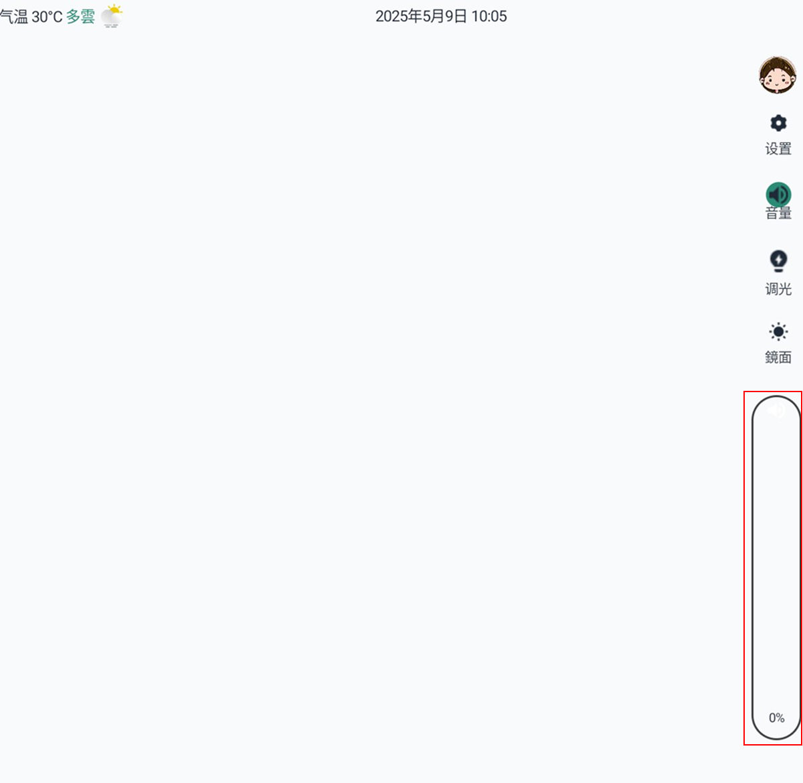
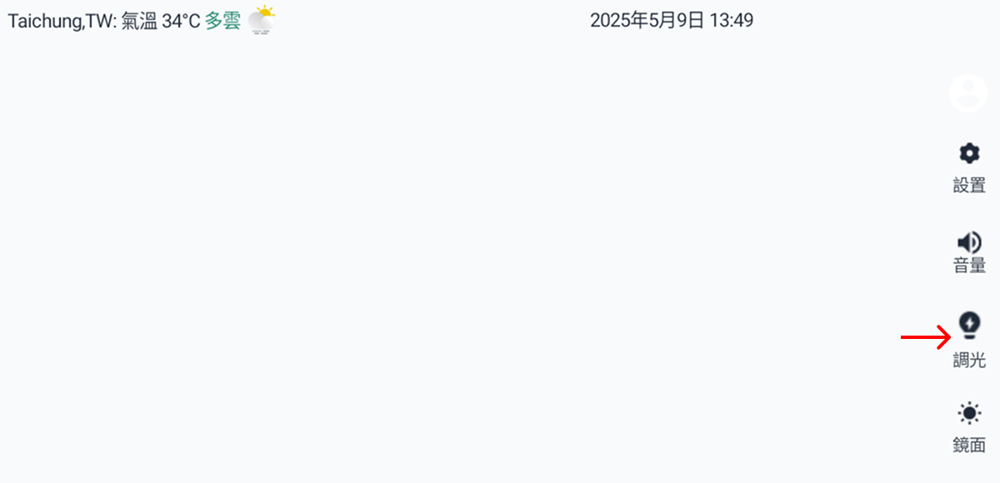
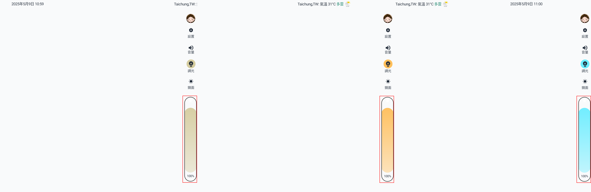
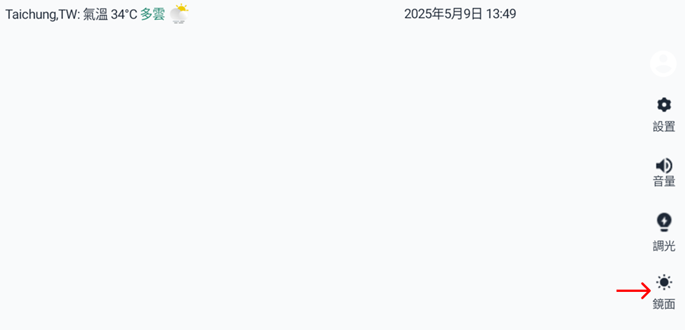
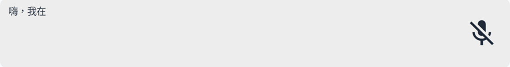
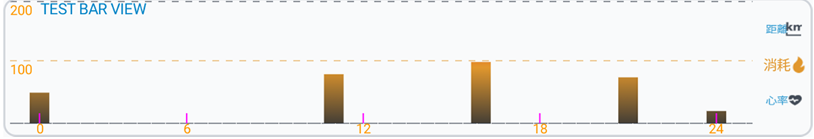
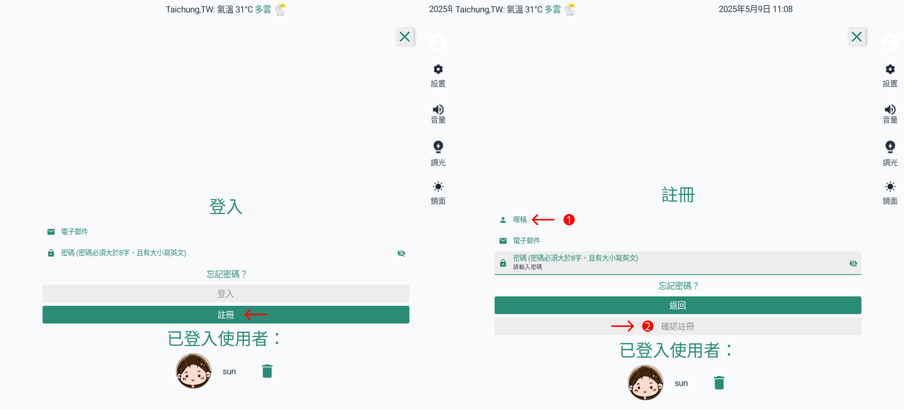

# 如何使用美容鏡：

美容鏡為用戶提供AI檢測功能，可快速分析臉部皺紋狀況，並提供個人化的改善建議。讓用戶可在家輕鬆掌握肌膚狀態並依建議進行日常保養。

## 使用指南：

- 裝置控制：
  - 右側導航列會顯示裝置主要控制介面，包含音量、燈光等。
    
  - 點擊任一控制選項，即可開啟對應調整面板，快速進行設定。
    
  - 設置：可設定目前所在城市、選擇偏好語言與裝置的網路連接等，讓裝置運作更符合您的使用需求。
  - 日曆：可編輯個人化行程，並搭配AI智能提醒功能，協助您管理日常行程。
    (可新增行程並啟用鬧鐘與AI智能提醒，協助管理日常行程。)
  - 音量：可調節裝置聲音大小。
    
    
  - 燈光：三段式燈光設計：白光、暖光、冷光，檢測時可自由切換合適的光源與亮度。
    
    
  - 鏡面：啟用此模式後，裝置可作為鏡子使用。
    
- 主要功能區：
  - 主要顯示美容鏡主要的功能，包含美容百科、AI檢測等。
    
  - 點擊任一功能，即可跳轉至相應介面。
    
  - AI提醒：可查看個人化的美容與健康AI分析結果。
  - 裝置：可連接並查看已配對的手錶裝置。
  - 美容百科：可查看不同主題的美容文章。
  - AI功能：可透過AI功能檢測臉部皺紋狀況並獲得個人化分析
- AI語音功能：
  - 您可以透過AI語音對話功能諮詢美容相關問題或操控美容鏡。
    
- GTS 手錶檢測紀錄
  - 主要顯示 Starmax GTS 手錶檢測出的健康數據，包含心律、睡眠等。
    (這裡可查看GTS手錶檢測出的健康數據，包含心律、睡眠等。)
    
- 登入/註冊
  - 您可以操作會員登入，或點按註冊按鈕，進入註冊流程
    
- 會員專區
  - 您可以在會員中心註冊以及登入會員後，查看個人資訊、文章瀏覽收藏紀錄、喜愛文章以及下載會員檢測紀錄，並編輯個人資料與密碼。
    (可以由此註冊/登入會員，查看個人資訊、文章瀏覽紀錄以及下載檢測結果)

## 注意事項：

- 記得註冊成為會員，獲得更多個人化功能和檢測結果分析。
