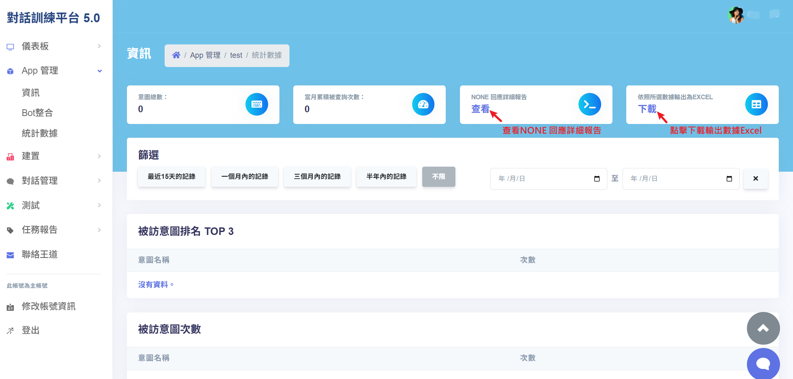
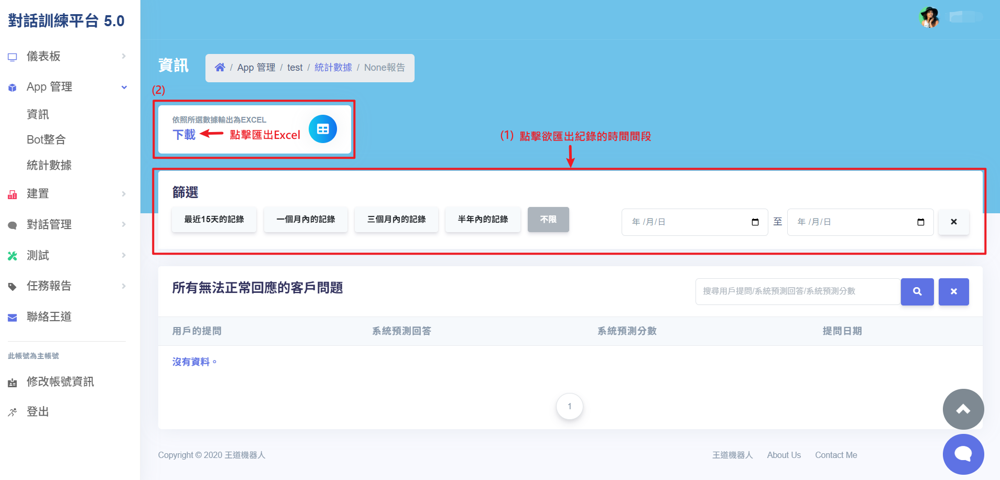

# APP 管理 - 資訊/ BOT 整合/統計數據

使用者可透過本功能進行APP 管理作業，包括 API 發布、Facebook/LINE ChatBot 整合，以及查看統計數據報告。此功能旨在協助使用者管理 APP 相關設定與營運數據，促進應用程式整合與數據追蹤的便捷性。

## 操作說明

### 資訊

- **更新 APP 資訊**：勾選「□ 更新按鈕」後，即可編輯 APP 的敘述內容。
- **API 發布**：完成 APP 訓練後，可透過此功能進行發布，並取得 API URL 網址供後續串接使用。

### BOT 整合

- **Facebook ChatBot**：

1. 申請並建立 Facebook ChatBot：請先至 FB 官方網站完成 ChatBot 建立與串接相關設定，詳細操作請參考 FB 官方網站。
2. 啟用 FB ChatBot 功能：回到本平台，勾選「□ 啟用 FB ChatBot 功能」，即可啟用相關功能設定。
3. 填寫 FB 粉絲專頁 「Access Token」、「Verify Token」：將 FB 開發平台提供的「Access Token」、「Verify Token」填入對應欄位。設定完成後，即可開啟自動回覆聊天功能。
4. 更新「Access Token」或「Verify Token」：勾選「□ 更新 Access Token」或「□ 更新 Verify Token」，即可更新相關資訊。

- **LINE ChatBot**：

1. 申請並建立 LINE ChatBot：請先至 LINE 官方網站完成 ChatBot 建立與串接相關設定，詳細操作請參考 LINE 官方網站。
2. 啟用 LINE ChatBot 功能：回到本平台，勾選「□ 啟用 LINE ChatBot 功能」，即可啟用相關功能設定。
3. 填寫 LINE 粉絲專頁「Access Token」、「Verify Token」：將 LINE 開發平台提供的「Access Token」、「Verify Token」填入對應欄位。設定完成後，即可開啟自動回覆聊天功能。
4. 更新「Access Token」或「Verify Token」：勾選「□ 更新 Access Token」或「□ 更新 Verify Token」，即可更新相關資訊。

### 統計數據

- **意圖總數**：顯示目前已建立意圖數量。
- **當月累積被查詢次數**：顯示本月已建立的意圖當月的查詢次數。
- **None 回應詳細報告**：

1. 點選「查看」： 點選 None 報告欄中的「查看」按鈕後，即可進入「None 詳細報告」頁面。
2. 查看報告內容：報告中將顯示所有無法正常回應的使用者提問，內容包含：使用者提問內容、系統預測回答內容、系統預測分數以及使用者提問日期等紀錄。也可透過時間篩選功能，查詢特定時間範圍內的回應紀錄。
3. 下載數據輸出為 Excel：
   1. 設定時間篩選條件：於頁面的篩選功能，選擇欲匯出紀錄的時間區間。
   2. 下載數據：點擊「下載」按鈕，系統將自動匯出對應時間段內的紀錄(Excel)

- **被訪問意圖 TOP3**：顯示被使用者查詢次數最多的三個意圖。
- **被訪意圖次數**：顯示所有已建立意圖被使用者查詢的次數。

