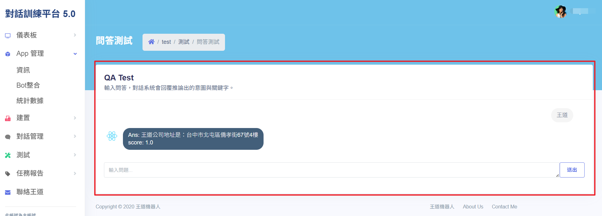

# 測試

使用者可透過本功能來測試系統的意圖辨識與回應準確性，包括問答測試以及對話紀錄等功能。本功能旨在協助使用者檢視對話結果，並提升整體對話系統的準確性。

## 操作說明

- **問答測試**：可透過文字輸入來測試系統是否正確辨識意圖並回應正確答案。
- **對話紀錄**(開發中)：可查看紀錄問答的正式結果(不包含問答測試)。紀錄內容包括詢問時間、詢問內容、其推潤可能的意圖結果及處理反應時間和對應意圖的回答。

