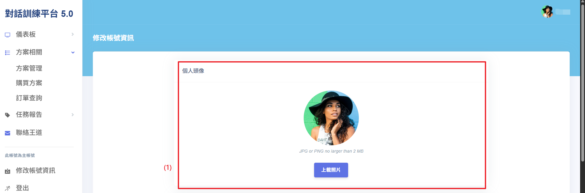
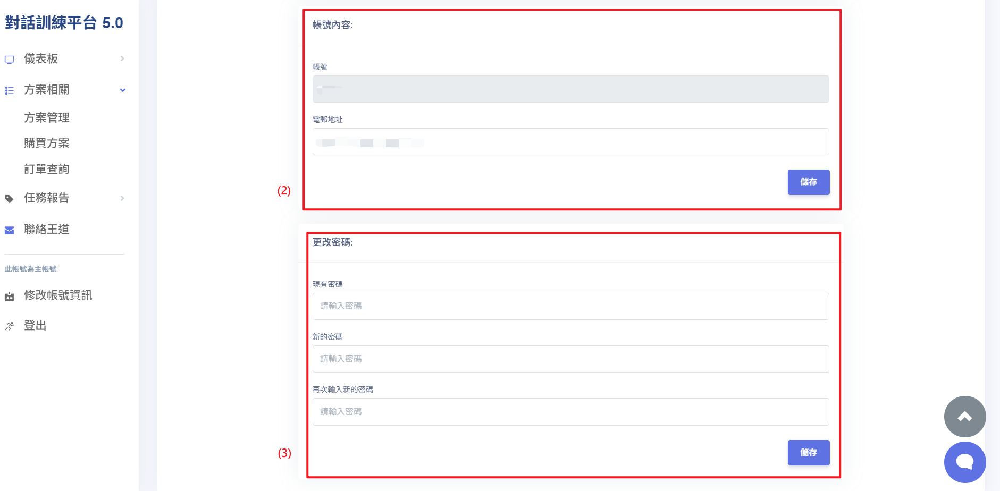

# 修改個人資料與密碼

使用者可以通過修改帳號資訊頁面來更新個人訊息與修改密碼，以提升帳號安全性。此功能允許使用者隨時管理自己的資料，確保信息的正確性與帳號的安全。

## 操作說明

完成註冊與登入流程：依照註冊流程完成註冊後，再進行登入。

1. **替換個人頭像圖片**：點擊「上載圖片」按鈕，選擇一張照片作為個人頭像使用。圖片檔案限制：JPG 、 PNG ，不可超過 2 MB。
2. **變更電子郵件**：在帳號內容欄中，更新或填寫電子郵件，確認無誤後點擊「儲存」按鈕進行更新。
3. **變更密碼**：首先需先驗證舊密碼，並確保新密碼與舊密碼不同且兩次輸入的新密碼相同。成功修改密碼後，系統將自動更新。
   
   
