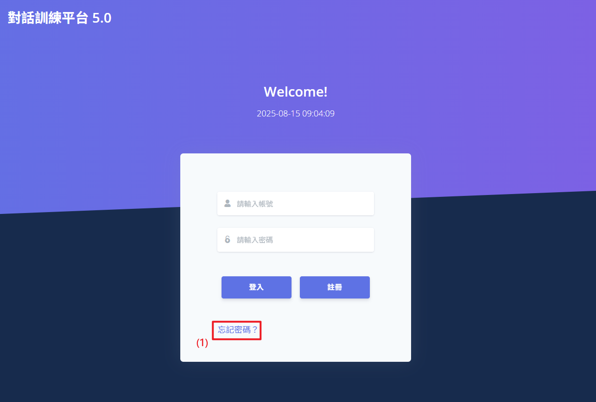
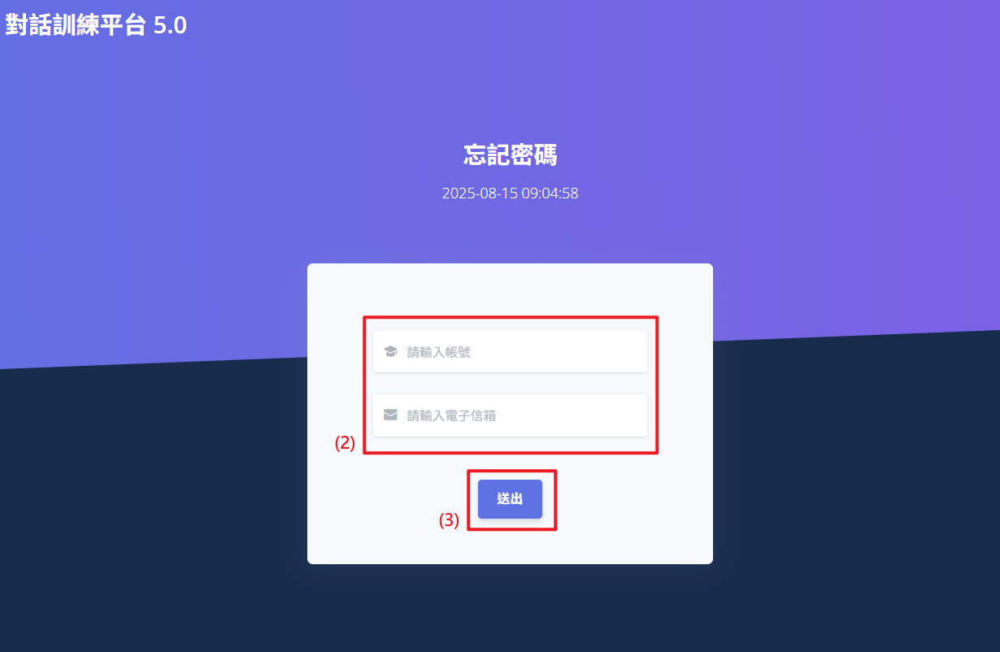
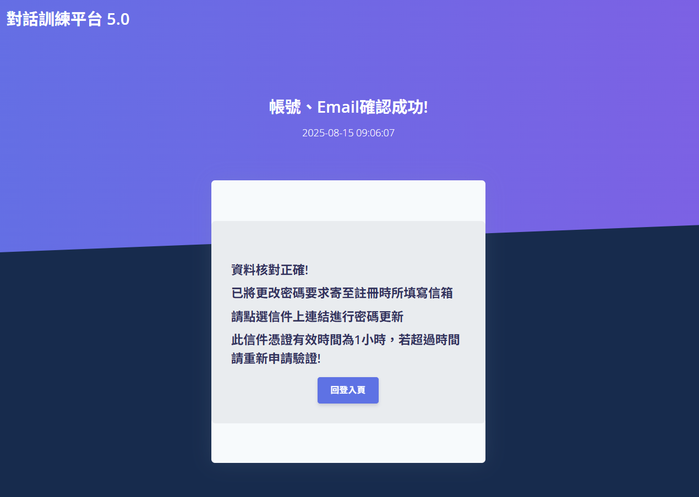
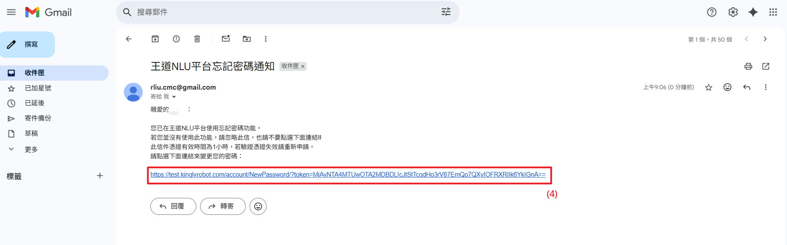
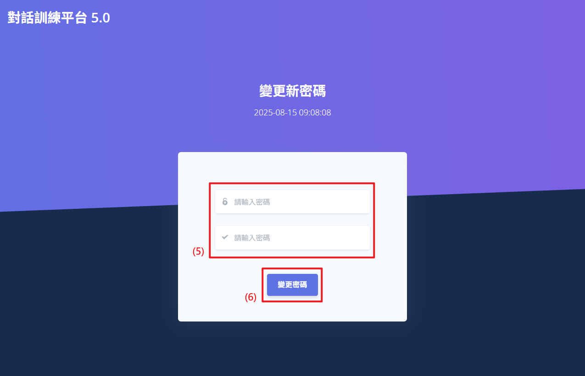
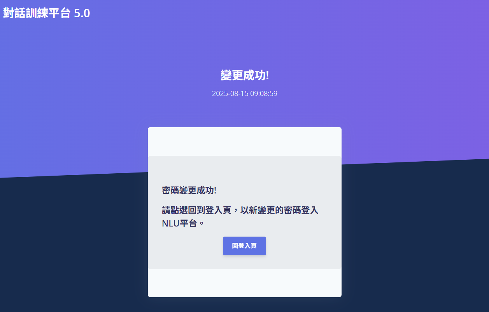

# 忘記密碼流程

當使用者忘記帳號密碼時，網站提供了忘記密碼的功能。使用者可以通過電子郵件找回密碼，並按照步驟完成密碼重設，從而安全的恢復對帳號的訪問。

## 操作手冊

1. **點擊「忘記密碼」**：在登入介面中，點擊密碼欄位下方的「忘記密碼」連結，進入忘記密碼頁面。
2. **填寫會員資料**：輸入有效的帳號名稱以及電子郵件地址，系統將自動驗證信箱格式是否正確。
3. **點擊「送出」**：點擊「送出」按鈕後，系統會檢查該電子郵件是否存在於資料庫中。無論成功或是失敗，系統將通知使用者。發送成功後，電子郵件將無法更改，且在60秒內不可再次請求發送驗證信。
4. **點擊信件「點我重設密碼」**：前往您的電子郵件收件夾(如：Google 信箱)，找到來自系統的重設密碼信件，並點擊信中的「點我重設密碼」鏈接，進入重設密碼頁面。
5. **填寫新密碼**：新密碼需符合格式，並且兩次新密碼必須一致。
6. **點擊「送出」**：確認兩次輸入的新密碼一致後，點擊「送出」按鈕完成重設。成功重設密碼後，系統將自動重導向登入頁面，使用者需再次登入。
   
   
   
   
   
   
