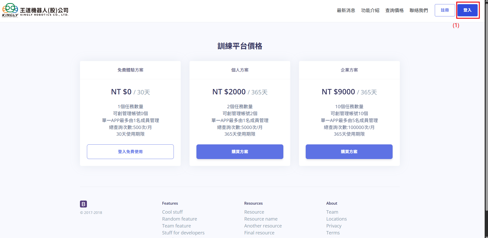
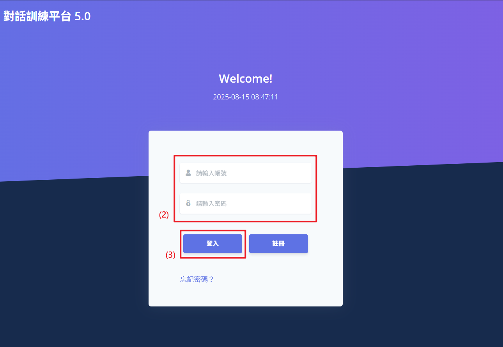
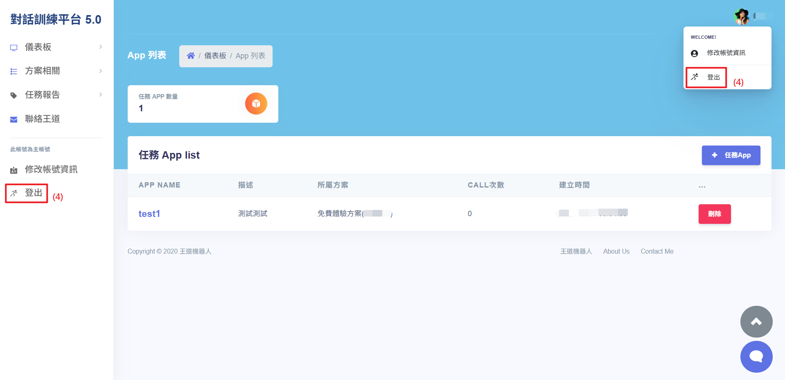

# 登入與登出流程

此功能為使用者提供了登出會員帳號以及登出完整流程。登入後，您可以試用 APP 對話訓練功能。登出後，可保障帳號與個人資料安全。

## 操作說明

完成註冊流程：依照註冊流程完成註冊後，再進行登入。

1. **點擊「登入」**：在首頁的右上方點擊「登入」按鈕，將跳轉至登入頁面。
2. **填寫個人會員帳號與密碼**：在登入頁面上，輸入您有效的帳戶名稱與密碼。
3. **提交登入**：確認所有資料無誤後，點擊「登入」按鈕。若登入成功，系統將自動跳轉至對話訓練平台首頁。
4. **點擊「登出」**：成功登入後，會員可在左側導航列以及個人頭像中找到「登出」按鈕。點擊後，系統將自動執行登出，確保使用者帳號的安全性。
   
   
   
