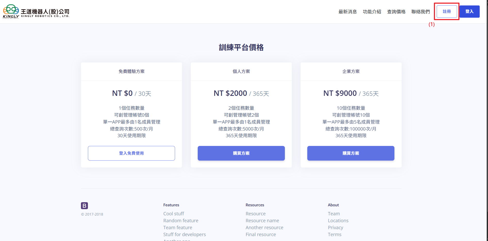
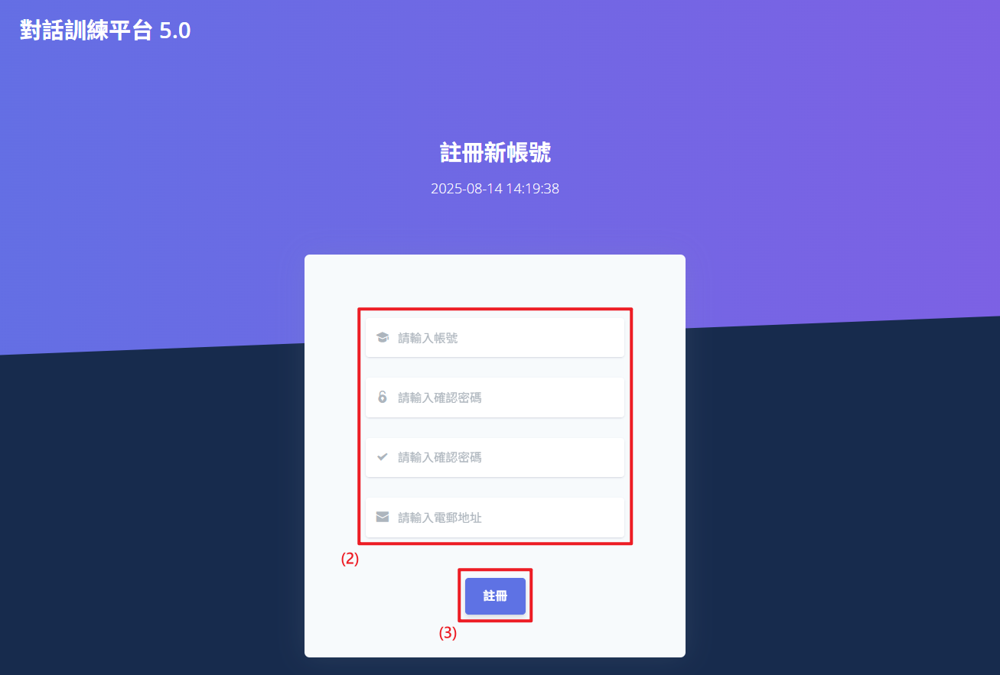
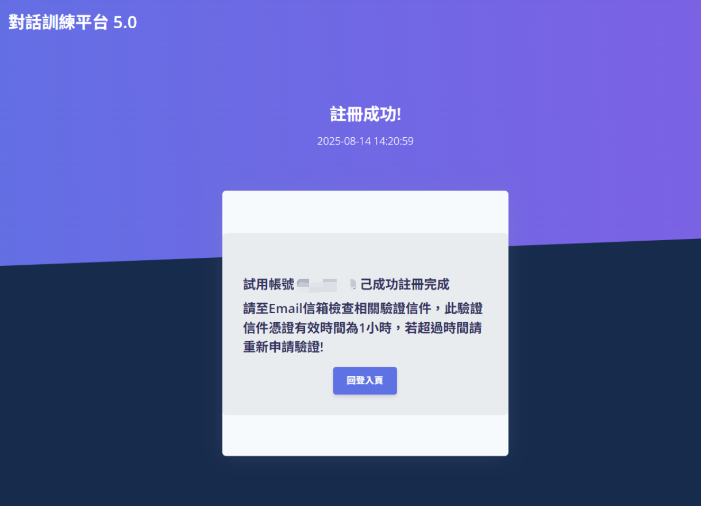
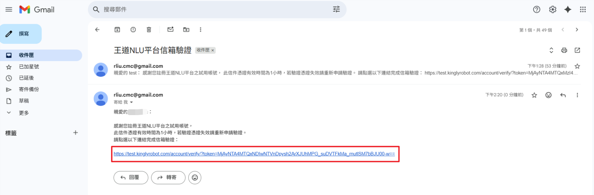
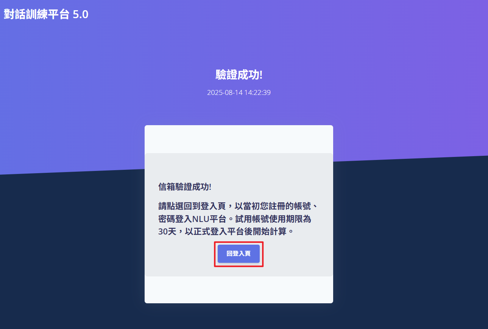
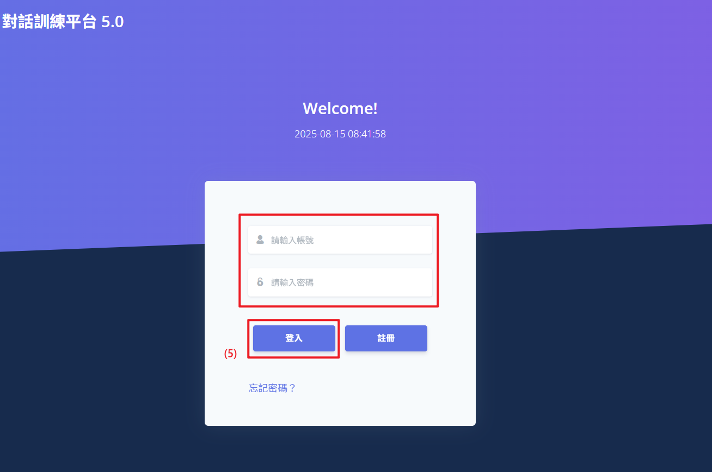

# 註冊新帳號

此功能允許新用戶在對話訓練平台網站上註冊帳號，並提供現有用戶登入途徑。通過註冊，用戶可以開通 APP 對話訓練試用帳號，體驗對話訓練功能，進一步提升使用體驗。

## 操作說明

1. **點擊「註冊」按鈕**：在首頁的右上方點擊「註冊」按鈕，將跳轉至註冊頁面。
2. **填寫註冊資料**：在註冊頁面上，輸入您有效的電子郵件、設定帳號以及密碼。
3. **提交註冊**：確認資料無誤後，點擊「註冊」按鈕。系統將提示帳號註冊成功，並自動發送驗證信至您填的信箱。
4. **點擊驗證「mail」**：確認註冊成功後請至郵箱中點擊驗證連結，開通試用帳號。
5. **重新登入帳戶**：驗證完成後，點擊下方「回登入頁」按鈕，在使用新的帳號密碼重新登入。
   
   
   
   
   
   
