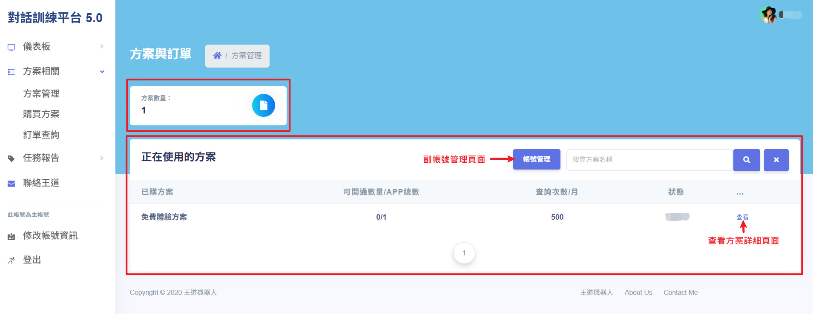
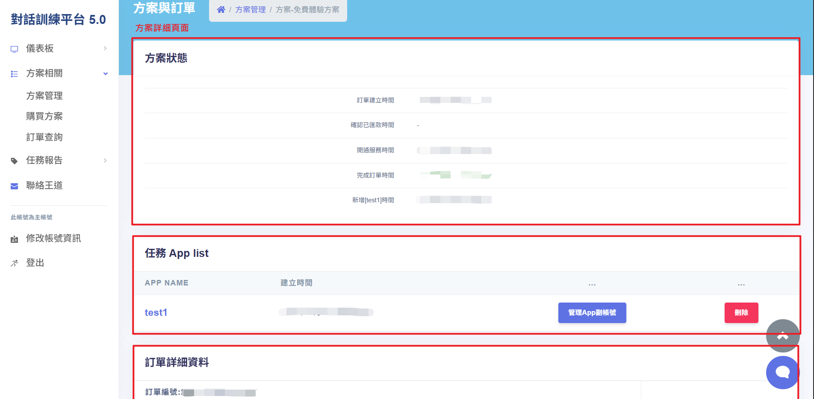
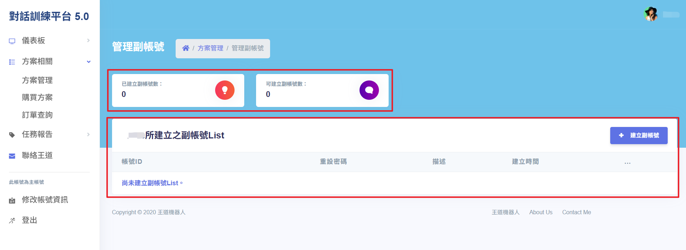
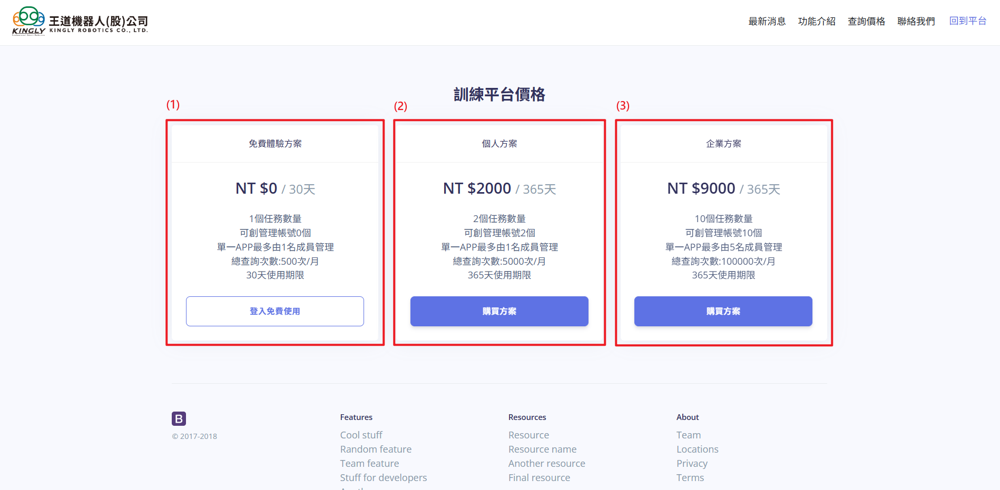
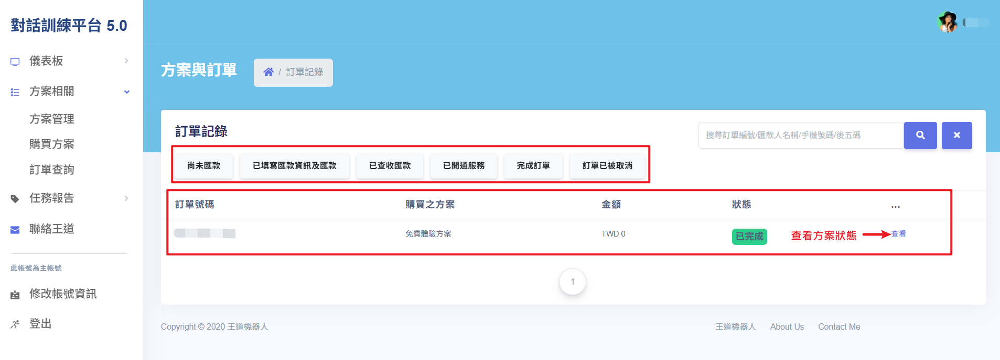
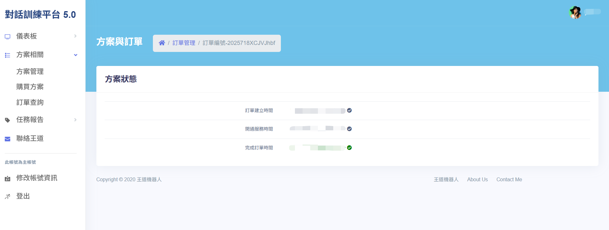

# 方案相關 - 方案管理/購買方案/訂單查詢

使用者可以透過本頁面進行方案管理作業，包含查看購買方案、正在使用的方案清單與訂單查詢等功能。本功能旨再提供使用者掌握各方案狀態，方便後續管理與使用。

## 操作說明

### 方案管理

- **方案數量**：可查看目前已建立所有方案數量。
- **正在使用的方案**：可查看目前正在使用的方案清單。
- **查看方案詳細資料**：在「正在使用方案」清單中，點擊任一方案右側「查看」按鈕，即可進入該方案的詳細資料頁面，查看完整資訊。
- **帳號管理(副帳號)**：點選搜尋欄旁的「帳號管理」按鈕，即可進入副帳號(管理帳號)的管理頁面，查看相關內容。

### 購買方案

1. **免費體驗方案**：
   - 1 個任務數量。
   - 可創管理帳號 0 個。
   - 單一 APP 最多由 1 名成員管理。
   - 總查詢次數：500次/月。
   - 30 天使用期限，登入即可使用。
2. **個人方案**：
   - 2 個任務數量。
   - 可創管理帳號 2 個。
   - 單一 APP 最多由 1 名成員管理。
   - 總查詢次數：5000次/月。
   - 365 天使用期限/NT $2000。
3. **企業方案**：
   - 10 個任務數量。
   - 可創管理帳號 10 個。
   - 單一 APP 最多由 5 名成員管理。
   - 總查詢次數：10000次/月。
   - 365天使用期限/NT $9000。

### 訂單查詢

- **訂單紀錄**：可查詢歷史訂單紀錄與對應的詳細資訊。點選任一訂單，可查看所購買的方案名稱與當前狀態，並可依不同訂單狀態進一步檢視處理進度。
- **支援顯示的訂單狀態包含**：尚未匯款、已填匯款資訊/已匯款、已查收匯款、已開通服務、訂單已被取消等狀態。

