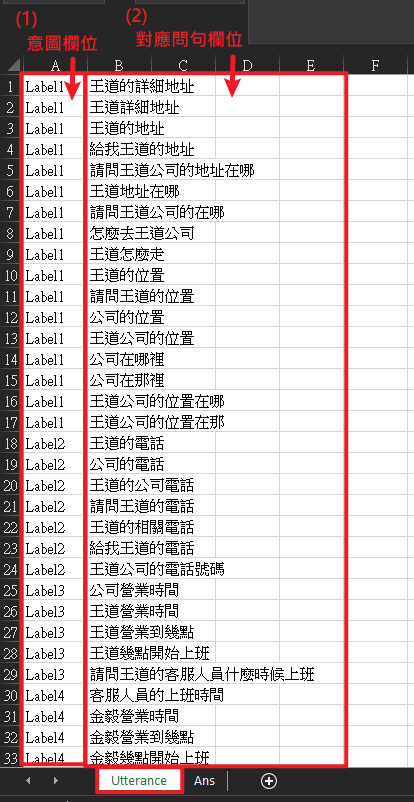
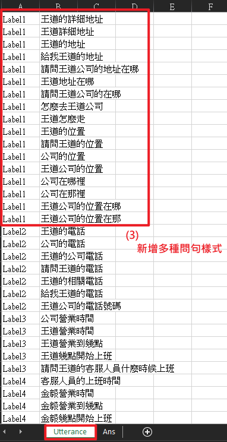

# 如何建立 Excel 檔?

此檔案為建立模型所需的相關訓練資料，有助於提升系統執行能力、回應精準度與應對彈性。

## Excel 中的工作表

### Utterance (同一意圖不同說法)

此工作表為定義使用者針對同一個意圖所提出的多種類似句型樣式。此資料有助於系統辨識不同表達方式，提高正確判斷機率。

#### 操作說明：

1. **新增「意圖」欄位**：在表格中新增一欄「意圖」，輸入每筆問句所對應意圖名稱。
2. **新增「對應問句」欄位**：在「意圖」欄位旁新增一欄「類似問句」，輸入使用者可能提出的多種問法。
3. **新增多種問句樣式**：請為不同的意圖，分別新增至少五種以上的問句，並確認每個問句中皆包含相關的關鍵字(Entity)，以利系統準確判斷。

- 範例：若問句為"王道公司電話"，其對應的意圖為"問公司電話"。

### Ans (回覆範本)

此工作表為定義系統判斷出使用者的意圖後所對應的回覆內容。此資料讓系統能準確給使用者提供適當的回應。

#### 操作說明：

1. **新增「意圖」欄位**：在表格中新增一欄「意圖」，輸入所需的使用者意圖名稱。
2. **新增「回應」欄位**：在各種使用者意圖欄位下，新增對應回覆內容，供系統回答使用者使用。若意圖中有多個回應，系統將會隨機回覆。

