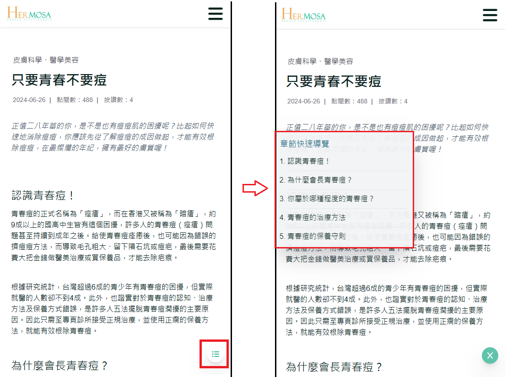

# 查看文章內容

當使用者點擊文章卡片後，將進入文章詳情頁面。在此頁面，使用者可以瀏覽完整的文章內容，並進行多種操作，如按分類搜尋、收藏文章、按讚、快速導覽章節、留言互動及查看推薦文章等。

## 操作說明

### 桌機版操作步驟

1. **點擊主類**：點擊主類 (例如：皮膚科學) 後，系統將重導向至該主類別的文章列表頁，顯示該分類下的所有文章。
2. **點擊收藏與按讚**：點擊收藏或按讚按鈕時，若使用者尚未登入，系統會彈出登入提示，確認後將跳轉至登入頁面。登入成功後，系統將自動返回文章詳情頁，並立即執行收藏或按讚操作。
3. **章節快速導覽**：點擊章節快速導覽中的段落標題，頁面將自動滾動至對應的文章段落，方便使用者快速瀏覽長篇內容。
4. **點擊關鍵字**：點擊文章中的關鍵字，系統將跳轉至搜尋結果頁，並顯示所有與該關鍵字相關的文章。
5. **留言功能**：使用者可以在留言區輸入評論，並有清空內容的選項。預設顯示5條留言，點擊「顯示全部」後可查看所有留言，讓使用者與其他讀者進行互動。
6. **推薦文章**：文章底部會顯示與該文章相關的推薦文章卡片。使用者可以點擊卡片，直接進入相關文章的詳情頁，進一步提升網站的內容流轉和使用者停留時間。
   

### 移動版操作步驟

- **章節快速導覽**：點擊右下方的選單 ICON 來開啟或關閉章節快速導覽功能，使用者可以通過點擊對應的章節標題快速跳至文章相應位置。
- **其他操作**：與桌機版一致，移動版也支持收藏、按讚、留言、推薦文章等功能，確保在不同設備上的使用體驗一致。
  

### 補充說明

- **桌機與移動版功能一致性**：無論是桌機還是移動設備，使用者都能進行主類和子分類切換、收藏和按讚文章、章節快速導覽、留言和查看推薦文章等操作。兩個版本的功能一致，但操作方式會根據設備有所調整，確保流暢的用戶體驗。
