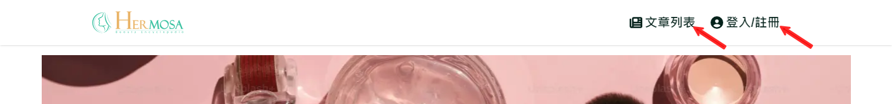
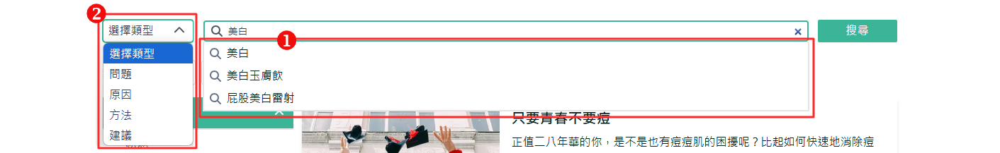
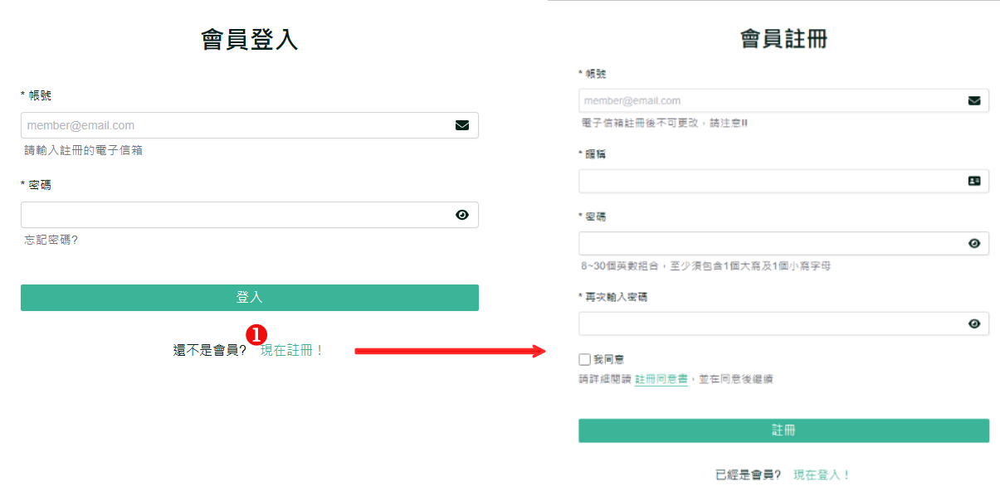
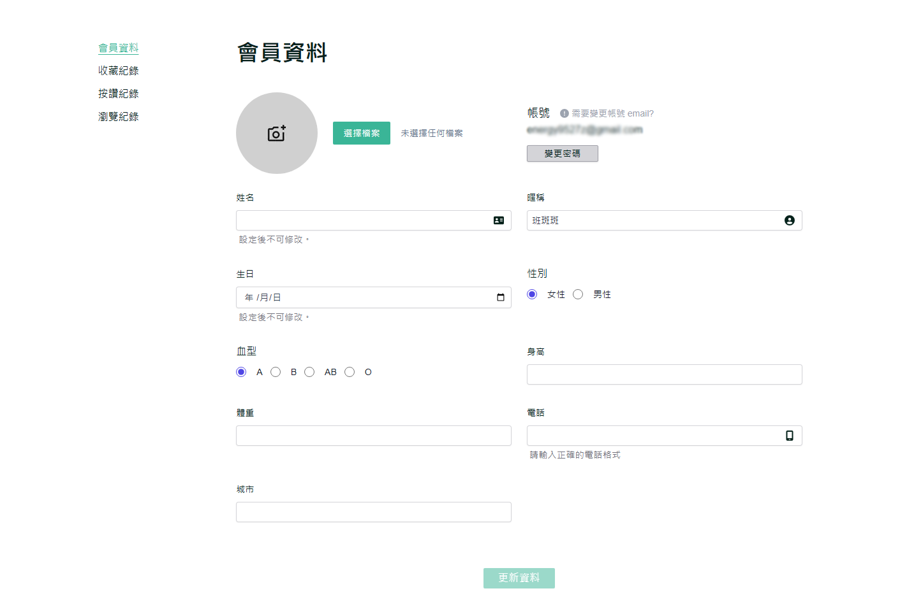

# 如何使用美容百科網站?

美容百科網站為用戶提供了豐富的美容資訊，並且可以輕鬆搜尋、瀏覽文章、收藏內容，還提供個人化的會員功能。這些功能幫助用戶快速獲取最新、最熱門的美容資訊。

## 使用指南：

- 網站導航：
  - 首頁導航列會顯示主要的網站功能區，包括文章列表、會員管理等。
    
  - 點擊任一導航選項，即可跳轉到相應頁面。
    
- 搜尋功能：
  - 於文章列表以及搜尋結果頁均有一個搜尋欄。您可以輸入關鍵字，搜尋與美容相關的文章或內容。
    
  - 搜尋時若有對應關鍵字則會顯示在下方(1)，也可選擇搜尋段落類型(2)，可通過進一步篩選來縮小範圍。
    
- 熱門文章與推薦內容：
  - 首頁會顯示當前最熱門的美容文章和系統推薦(登入時)的內容。您可以隨時點擊文章進入詳情頁面進行閱讀。
    
- 登入/註冊：
  - 您可以操作會員登入，或者點擊(1)現在註冊，進行會員註冊流程。
    
- 會員專區：
  - 您可以在會員中心註冊以及登入會員後，查看個人資訊、收藏紀錄、喜愛文章，並編輯個人資料及密碼。
    

## 注意事項：

- 美容百科網站支援桌面和移動設備，介面會根據不同設備進行自適應調整。
- 記得註冊成為會員，獲得更多個人化功能和文章推薦。
