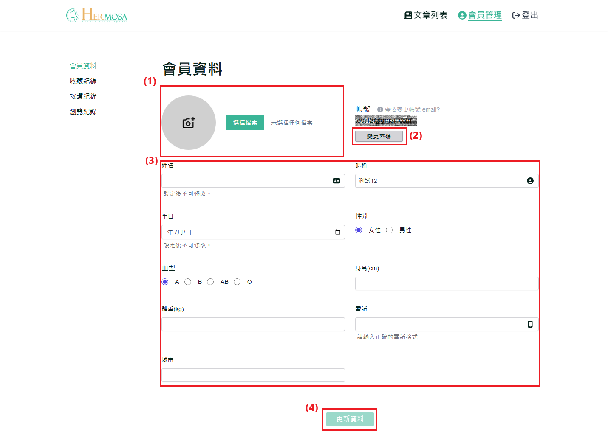
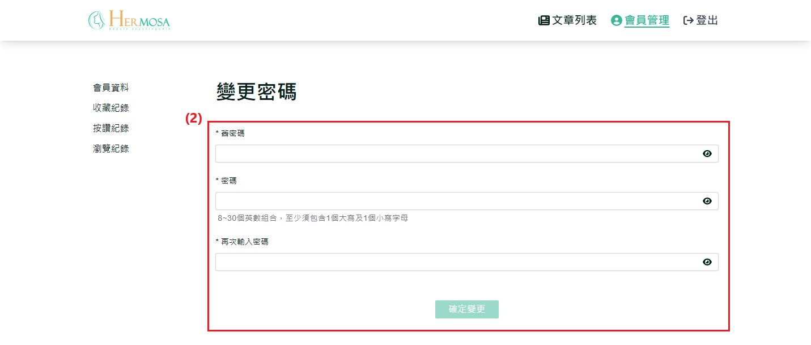
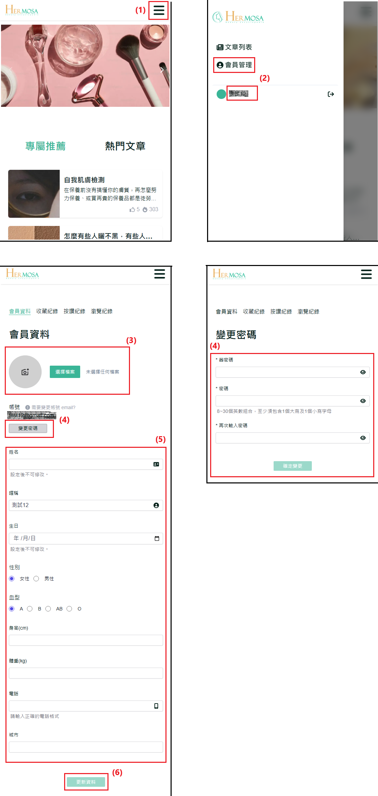

# 修改個人資料和密碼

使用者可以通過個人資料頁面更新個人信息和修改密碼，以提升帳號的安全性。此功能允許使用者隨時管理自己的資料，確保信息的正確性與帳號的安全。

## 操作說明

### 桌機版操作步驟

**完成註冊與登入操作**：依照 [註冊流程](./register-new-account.md#桌機版操作步驟) 完成註冊後，再進行 [登入](./login-logout-process.md#桌機版操作步驟)。

1. **替換個人頭像圖片**：點擊個人頭像或「選擇檔案」按鈕，選擇一張圖片作為個人頭像（圖片限制：2MB 以下，格式必須為 .jpg 或 .png）。
2. **變更密碼**：點擊「變更密碼」按鈕，進入變更密碼頁。首先需驗證舊密碼，並確保新密碼與舊密碼不同且兩次輸入的新密碼相同。成功修改後，系統將強制登出，使用者需重新登入。
3. **填寫個人資料**：更新或填寫個人資料，包括姓名、暱稱、生日、身高、體重等資訊。
4. **點擊「更新資料」**：完成資料更新後，點擊「更新資料」按鈕以保存更改。若未修改任何內容，按鈕將保持不可點擊狀態。
   
   

### 移動版操作步驟

**完成註冊與登入操作**：依照 [註冊流程](./register-new-account.md#移動版操作步驟) 完成註冊後，再進行 [登入](./login-logout-process.md#移動版操作步驟)。

1. **點擊右上角選單 ICON**：點擊右上角的選單按鈕以開啟導覽列。
2. **點擊「會員管理」或會員暱稱**：在導覽列中點擊「會員管理」或直接點擊會員暱稱，進入個人資料頁面。
3. **替換個人頭像圖片**：點擊個人頭像或「選擇檔案」按鈕，選擇圖片作為個人頭像（圖片限制：2MB 以下，格式必須為 .jpg 或 .png）。
4. **變更密碼**：點擊「變更密碼」按鈕進入密碼修改頁面，需驗證舊密碼，並確保新密碼與舊密碼不同，且兩次輸入的新密碼需相符。成功修改後，系統將強制登出，需重新登入。
5. **填寫個人資料**：更新或填寫個人資料，包括姓名、暱稱、生日、身高、體重等資訊。
6. **點擊「更新資料」**：確認資料後，點擊「更新資料」按鈕保存變更。若未進行任何修改，按鈕將保持不可點擊狀態。
   

### 補充說明

- **完善資料與個人資料更新功能的一致性**：無論是在首次登入後 [完善資料](./first_login_more_account.md)，還是後續的個人[資料更新](./edit-profile-and-password.md)，兩者功能基本一致，僅頁面展示有所不同。
