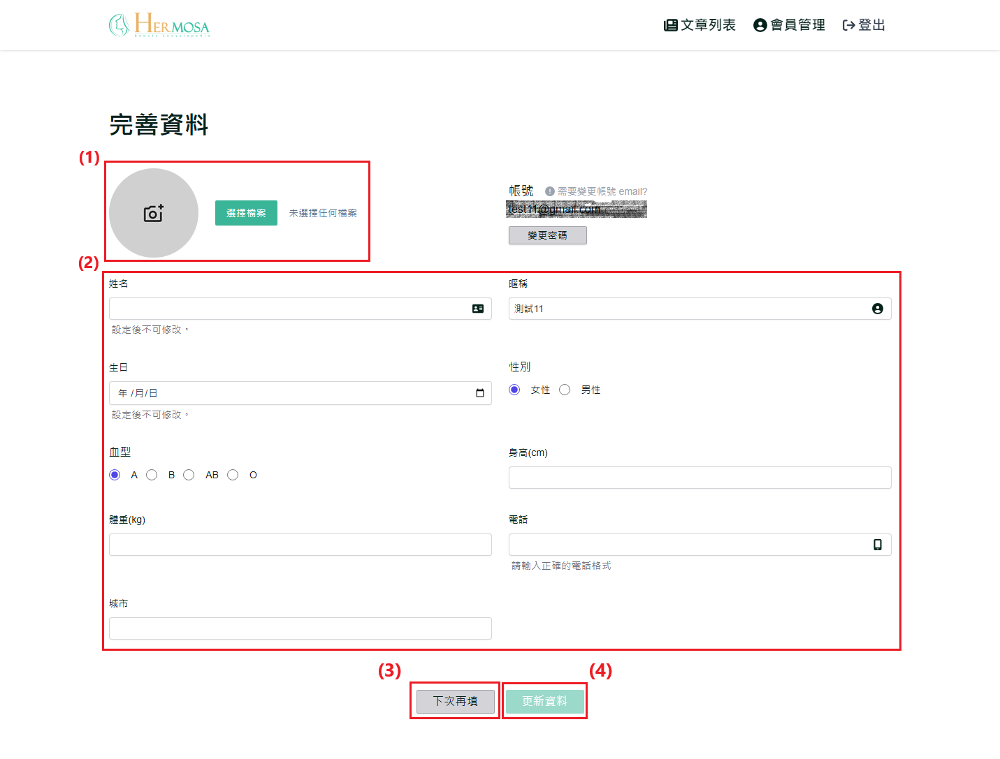
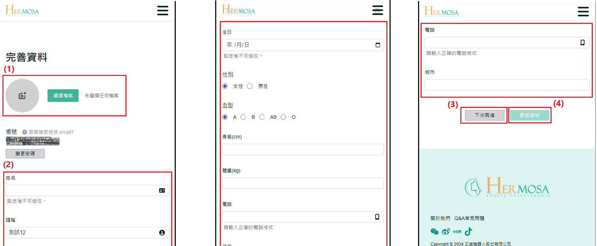

# 首次登入完善資料

當使用者首次登入美容百科網站時，系統將引導其至「完善資料」頁面。在此頁面，使用者可以更新或填寫個人基本資料，如姓名、聯絡方式等。此步驟幫助系統更好地提供個人化服務，確保帳戶資料的完整性。使用者可以選擇立即填寫資料，或者跳過此步驟並在稍後更新。

## 操作說明

### 桌機版操作步驟

**完成註冊與登入操作**：依照 [註冊流程](./register-new-account.md#桌機版操作步驟) 完成註冊後，再進行 [登入](./login-logout-process.md#桌機版操作步驟)。若為首次登入，系統將引導至完善資料頁面。

1. **替換個人頭像圖片**：在完善資料頁面中，點擊個人頭像或「選擇檔案」按鈕，選擇一張圖片作為個人頭像使用（圖片限制：大小不超過 2MB，格式必須為 .jpg 或 .png）。
2. **填寫個人資料**：在該頁面更新或填寫個人資料，包括姓名、暱稱、生日、身高、體重等資訊。
3. **點擊「下次再填」**：若不希望立即更新資料，點擊「下次再填」按鈕，系統將跳轉至首頁。未來再登入時將不再進入完善資料頁面。
4. **點擊「更新資料」**：完成資料更新後，點擊「更新資料」按鈕以保存變更。如果未修改任何內容，按鈕將保持不可點擊狀態。
   

### 移動版操作步驟

**完成註冊與登入操作**：依照 [註冊流程](./register-new-account.md#移動版操作步驟) 完成註冊後，再進行 [登入](./login-logout-process.md#移動版操作步驟)。若為首次登入，系統將引導至完善資料頁面。

1. **替換個人頭像圖片**：在完善資料頁面中，點擊個人頭像或「選擇檔案」按鈕，選擇一張圖片作為個人頭像使用（圖片限制：大小不超過 2MB，格式必須為 .jpg 或 .png）。
2. **填寫個人資料**：在該頁面更新或填寫個人資料，包括姓名、暱稱、生日、身高、體重等資訊。
3. **點擊「下次再填」**：若不希望立即更新資料，點擊「下次再填」按鈕，系統將跳轉至首頁。未來再登入時將不再進入完善資料頁面。
4. **點擊「更新資料」**：完成資料更新後，點擊「更新資料」按鈕以保存變更。如果未修改任何內容，按鈕將保持不可點擊狀態。
   

### 補充說明

- **完善資料與個人資料更新功能的一致性**：無論是在首次登入後 [完善資料](./first_login_more_account.md)，還是後續的個人[資料更新](./edit-profile-and-password.md)，兩者功能基本一致，僅頁面展示有所不同。
