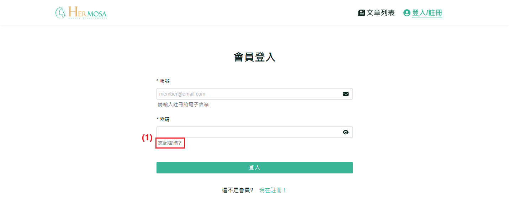
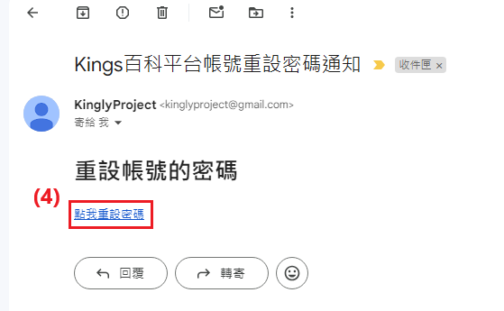

# 忘記密碼流程

當使用者忘記帳號密碼時，系統提供了忘記密碼的功能。使用者可以通過電子郵件找回密碼，按照步驟完成密碼重設，從而安全地恢復對帳號的訪問。

## 操作說明

### 桌機版操作步驟

1. **點擊「忘記密碼」**：在會員登入頁面中，點擊密碼欄位下方的「忘記密碼」連結，進入忘記密碼頁面。
   
2. **填寫會員帳號**：輸入有效的電子郵件地址，系統將自動驗證郵箱格式是否正確。
3. **點擊「發送驗證」**：點擊「發送驗證」按鈕後，系統會檢查該電子郵件是否存在於資料庫中。無論成功或失敗，系統將通知使用者。發送成功後，電子郵件地址將無法修改，且在60秒內不可再次請求發送驗證信。
   
   
4. **點擊信件「點我重設密碼」**：前往您電子郵件收件夾（如 Google 信箱），找到來自系統的重設密碼信件，並點擊信中的「點我重設密碼」連結，進入重設密碼頁面。
    
   
5. **填寫新密碼**：新密碼需符合指定格式，並且兩次輸入的新密碼必須一致。
6. **點擊「送出」**：確認兩次輸入的新密碼一致後，點擊「送出」按鈕完成重設。成功重設密碼後，系統將自動重導向登入頁面，使用者需再次登入。
   

### 移動版操作步驟

與桌機板功能一致，主要差異在於移動端介面自適應不同。

### 補充說明

- **桌機與移動版功能一致性**：無論是桌機還是移動設備，使用者都能進行忘記密碼等操作。兩個版本的功能一致，但操作方式會根據設備有所調整，確保流暢的用戶體驗。
