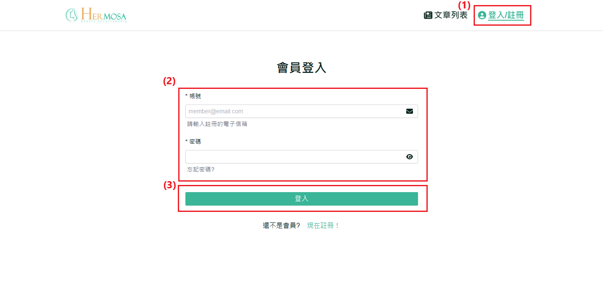
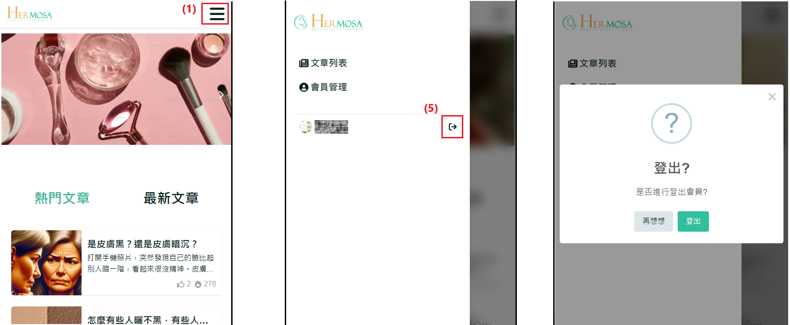

# 登入和登出流程

此功能為使用者提供了登入會員帳號及登出的完整流程。登入後，使用者可以訪問更多個人化功能，例如文章收藏、個人資料編輯等。登出功能確保使用者的帳號安全，尤其是在公共電腦或其他共享設備上使用時。

## 操作說明

### 桌機版操作步驟

1. **點擊「註冊/登入」**：在網站的導覽列中點擊「註冊/登入」按鈕，將跳轉至登入頁面。
2. **填寫個人會員帳號與密碼**：在登入頁面上，輸入您的有效電子郵件地址和密碼。
3. **提交登入**：確認所有資料無誤後，點擊「登入」按鈕。若登入成功，系統將顯示提示並自動跳轉至首頁或是點擊登入時的頁面；如果首次登入，則會跳轉至 [完善資料頁](/docs/website-features/member-features/first_login_more_account.md)，用戶可以選擇填寫更多個人資訊或跳過。
   
4. **點擊「登出」**：成功登入後，使用者可以在網站的導覽列中找到「登出」按鈕。點擊後，系統將彈出確認視窗，再次點擊確認即可執行登出，確保使用者帳號的安全性。
   
   

### 移動版操作步驟

1. **點擊右上角選單 ICON**：開啟導覽列功能
2. **點擊「註冊/登入」**：在網站的導覽列中點擊「註冊/登入」按鈕，將跳轉至登入頁面。
3. **填寫個人會員帳號與密碼**：在登入頁面上，輸入您的有效電子郵件地址和密碼。
4. **提交登入**：確認所有資料無誤後，點擊「登入」按鈕。若登入成功，系統將顯示提示並自動跳轉至首頁或是點擊登入時的頁面；如果首次登入，則會跳轉至 [完善資料頁](/docs/website-features/member-features/first_login_more_account.md)，用戶可以選擇填寫更多個人資訊或跳過。
   
5. **點擊「登出」**：成功登入後，使用者可以在移動版導覽列中找到「登出」符號按鈕。點擊後，系統將彈出確認視窗，再次點擊確認即可執行登出，確保使用者帳號的安全性。
   
