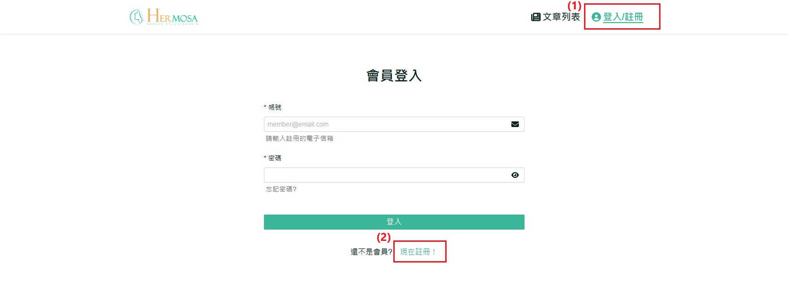
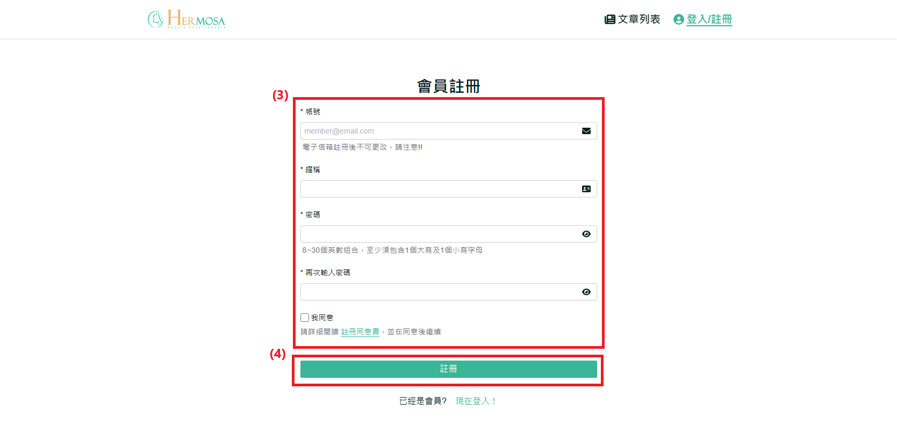
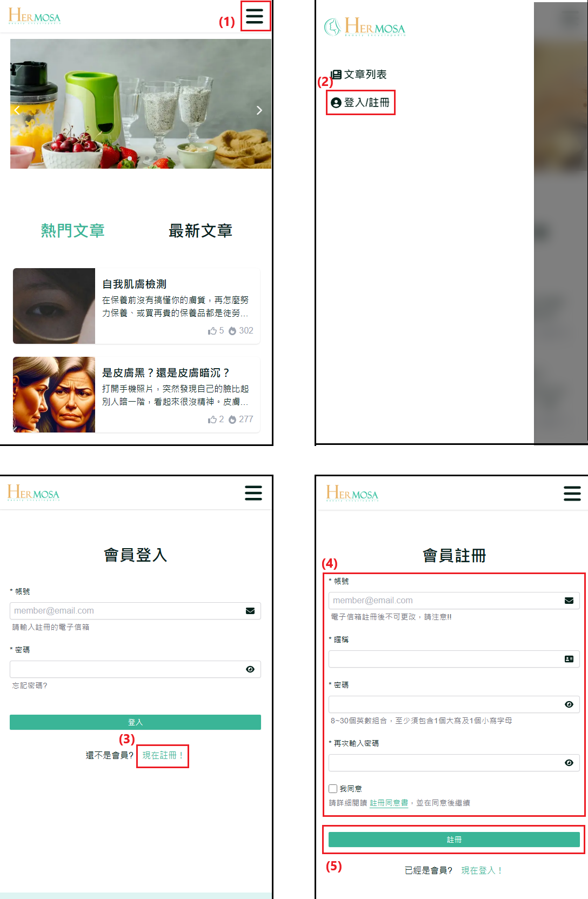

# 註冊新帳號

此功能允許新用戶在美容百科網站上註冊帳號，並提供現有用戶登入的途徑。通過註冊，用戶可以解鎖更多個人化功能，例如文章收藏、編輯個人資料等，提升使用體驗。

## 操作說明

### 桌機版操作步驟

1. **點擊「註冊/登入」**：在網站的導覽列中點擊「註冊/登入」按鈕，將跳轉至登入頁面。
2. **點擊「現在註冊」**：在登入頁面上，點擊「現在註冊」按鈕，進入註冊頁面。
3. **填寫註冊資料**：在註冊頁面上，輸入您的有效電子郵件地址、暱稱、設定密碼，並在密碼欄中再次確認密碼。請仔細閱讀註冊同意書，並勾選「我同意」以完成同意程序。
4. **提交註冊**：確認所有資料無誤後，點擊「註冊」按鈕。系統將提示帳號註冊成功，並自動重導向至登入頁面。用戶可使用新註冊的帳號與密碼登入。
     
   

### 移動版操作步驟

1. **點擊右上角選單 ICON**：開啟導覽列功能
2. **點擊「註冊/登入」**：在網站的導覽列中點擊「註冊/登入」按鈕，將跳轉至登入頁面。
3. **點擊「現在註冊」**：在登入頁面上，點擊「現在註冊」按鈕，進入註冊頁面。
4. **填寫註冊資料**：在註冊頁面上，輸入您的有效電子郵件地址、暱稱、設定密碼，並在密碼欄中再次確認密碼。請仔細閱讀註冊同意書，並勾選「我同意」以完成同意程序。
5. **提交註冊**：確認所有資料無誤後，點擊「註冊」按鈕。系統將提示帳號註冊成功，並自動重導向至登入頁面。用戶可使用新註冊的帳號與密碼登入。
   
