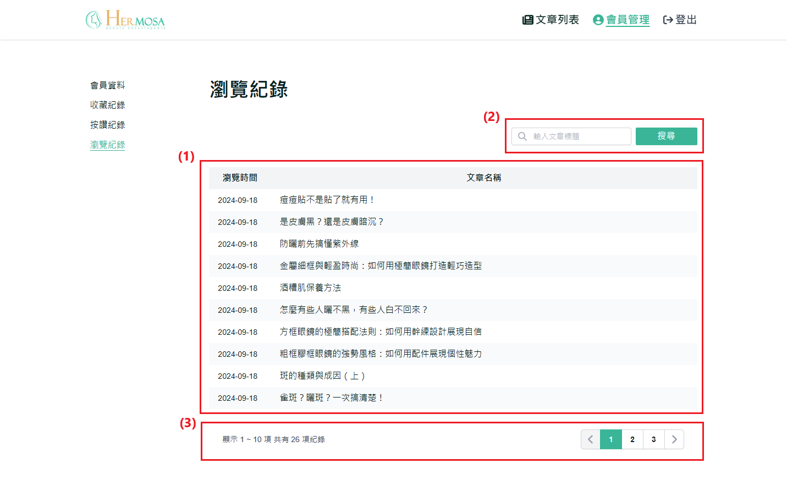

# 查看瀏覽紀錄

使用者可以通過瀏覽紀錄功能查看過去訪問過的文章。這使得使用者可以快速回到先前閱讀的內容，方便再次查看有價值的資訊。

## 操作說明

### 桌機版操作步驟

1. **顯示已瀏覽文章列表**：顯示使用者已瀏覽的文章列表。使用者可以通過點擊文章標題，直接前往該文章的詳情頁面。
2. **搜尋已瀏覽文章功能**：使用者可以在搜尋欄輸入關鍵字，按下「Enter」或點擊「搜尋」按鈕，系統會根據文章標題進行篩選，顯示符合搜尋條件的已瀏覽文章列表。
3. **分頁功能**：：當按讚的文章超過 10 篇時，系統會自動啟用分頁功能。使用者可以通過點擊頁碼或使用左右箭頭來切換不同頁面的文章列表。
   

### 移動版操作步驟

與桌機板功能一致，主要差異在於移動端介面自適應不同。
