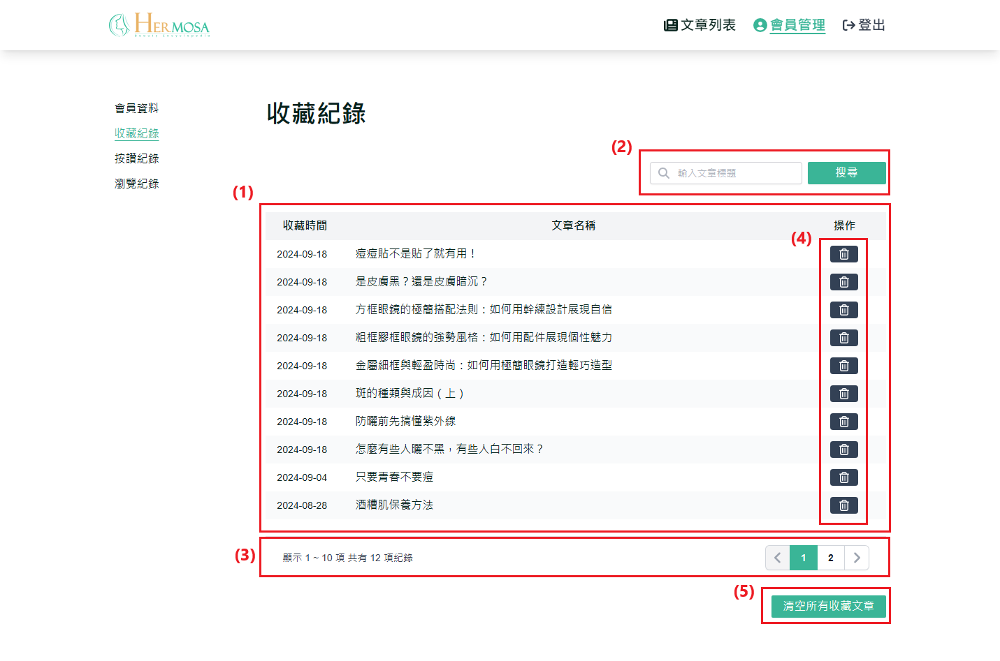

# 查看收藏紀錄

使用者可以在個人收藏頁面查看所有已收藏的文章列表。這個功能讓使用者可以輕鬆找到之前保存的內容，隨時重新閱讀他們感興趣的文章。

## 操作說明

### 桌機版操作步驟

1. **顯示收藏文章列表**：顯示使用者已收藏的文章列表。使用者可以通過點擊文章標題，直接前往該文章的詳情頁面。
2. **搜尋收藏文章功能**：使用者可以在搜尋欄輸入關鍵字，按下「Enter」或點擊「搜尋」按鈕，系統會根據文章標題進行篩選，顯示符合搜尋條件的收藏文章列表。
3. **分頁功能**：：當收藏的文章超過 10 篇時，系統會自動啟用分頁功能。使用者可以通過點擊頁碼或使用左右箭頭來切換不同頁面的文章列表。
4. **刪除單一文章收藏功能**：點擊單篇文章旁的刪除 ICON 後，系統將跳出確認視窗，要求使用者二次確認。確認後，該篇文章將從收藏列表中移除。
5. **刪除所有文章收藏功能**：點擊「清空所有文章」按鈕後，系統會彈出確認視窗。使用者需要再次確認操作，確認後系統將清空所有收藏文章。
   

### 移動版操作步驟

與桌機板功能一致，主要差異在於移動端介面自適應不同。
