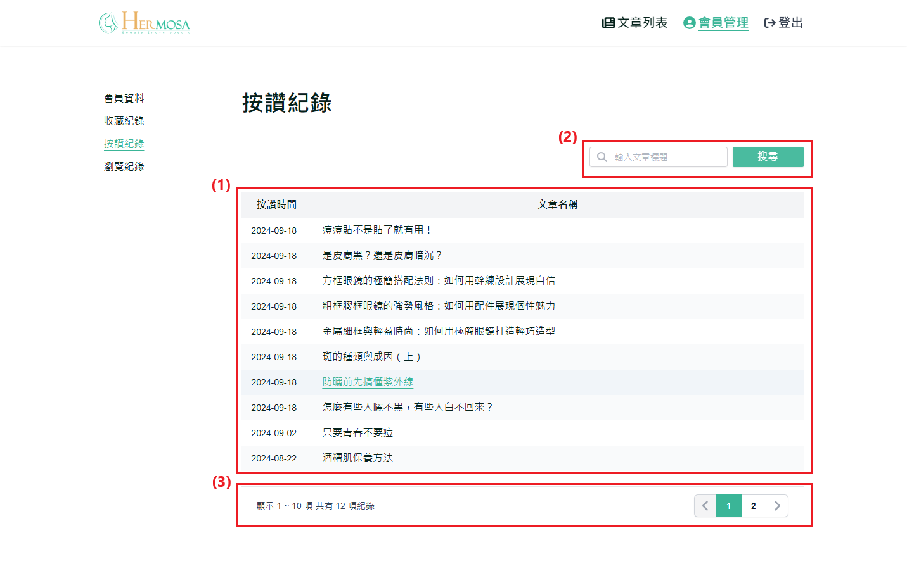

# 查看按讚紀錄

此功能允許使用者查看所有已按讚的文章列表。使用者可以快速回顧和訪問他們曾經點讚的內容，並隨時重新閱讀這些文章。

## 操作說明

### 桌機版操作步驟

1. **顯示按讚文章列表**：顯示使用者已按讚的文章列表。使用者可以通過點擊文章標題，直接前往該文章的詳情頁面。
2. **搜尋按讚文章功能**：使用者可以在搜尋欄輸入關鍵字，按下「Enter」或點擊「搜尋」按鈕，系統會根據文章標題進行篩選，顯示符合搜尋條件的按讚文章列表。
3. **分頁功能**：：當按讚的文章超過 10 篇時，系統會自動啟用分頁功能。使用者可以通過點擊頁碼或使用左右箭頭來切換不同頁面的文章列表。
   

### 移動版操作步驟

與桌機板功能一致，主要差異在於移動端介面自適應不同。
