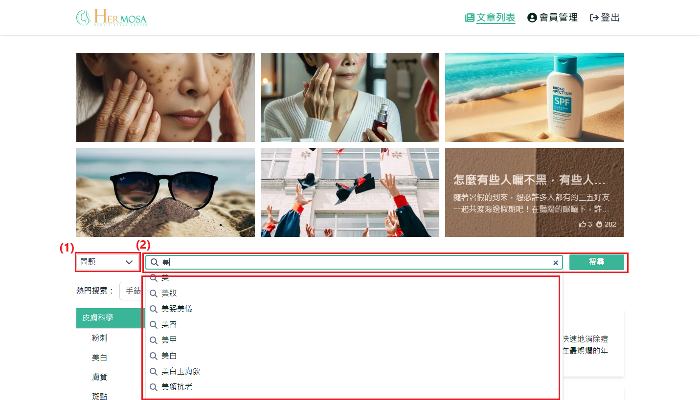

# 關鍵字與全站搜尋

使用者可以通過輸入關鍵字，進行全站範圍內的搜尋，系統將顯示所有與該關鍵字相關的文章和內容。且支持使用者根據特定的問題類型進行篩選搜尋，系統會根據該類型提供相關文章的搜尋結果，使搜尋更有針對性，節省時間。

## 操作說明

### 桌機版操作步驟

1. **選擇問題類型**：點擊「選擇類型」選單，選擇其一 "問題"、"方法"、"原因"、"建議"，不選擇則默認全站搜尋。
2. **輸入關鍵字取得關鍵字列表**：在文章列表或搜尋結果頁面，點擊搜尋框並輸入「美」後，系統會顯示相關關鍵字列表。使用者可以通過方向鍵上下移動並按下 Enter 鍵，或直接使用滑鼠點擊進行關鍵字搜尋，將重導向至 搜尋結果頁面。
3. **輸入關鍵字進行全站搜尋**：在文章列表或搜尋結果頁面，點擊搜尋框並輸入「美白」後，按下 Enter 鍵或點擊搜尋按鈕，系統將重導向至 搜尋結果頁面 進行全站搜尋。
   
4. **顯示搜尋結果相關文章**：顯示使用者輸入關鍵字搜尋後的文章列表。使用者可以通過點擊文章區塊，直接前往該文章的詳情頁面。
5. **顯示熱門關鍵字**：顯示當前熱門關鍵字列表，可直接點擊進行關鍵字搜尋。
6. **顯示推薦文章區塊**：顯示當前推薦文章列表，如果登入狀況下則會是(推薦/熱門)，未登入則是(熱門/最新)，使用者可以通過點擊文章區塊，直接前往該文章的詳情頁面。
   

### 移動版操作步驟

與桌機板功能一致，主要差異在於移動端介面自適應不同。
