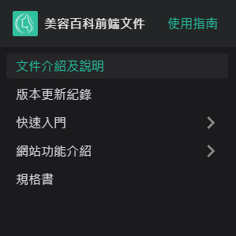
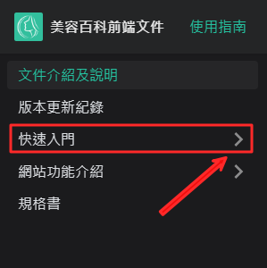
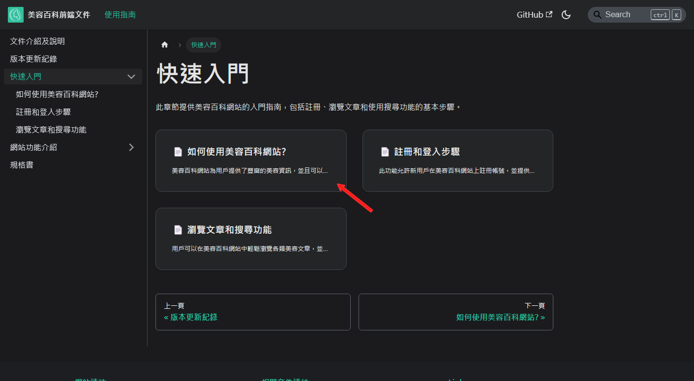
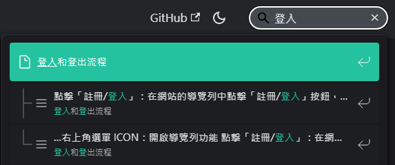
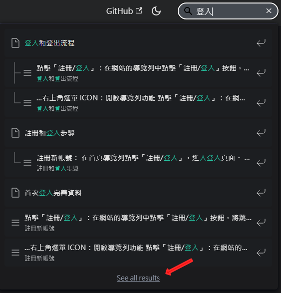

# 文档介绍及说明

本操作文档说明前端网站的操作说明，快速说明如何使用到基本功能。

## 根据快速入门或网站功能操作说明

快速入门介绍前端网站常用功能，提供简单使用步骤，网站功能介绍则提供更详细的前端网站功能，各自有不同的使用流程。

### 1. 选择快速入门/网站功能介绍

### 2. 展开子菜单

点击箭头可展开/收起子菜单，显示平台内可设置的功能列表。

点击文字，除了展开功能列表，页面还会列出该平台功能清单。

### 3. 选择需要了解的操作

例如点击 “如何使用美容百科网站？”

### 4. 阅读操作说明

就可以看到如何使用美容百科网站的具体流程。

## 使用搜索功能

除了按照平台分类查找功能外，在任何页面都可以使用右上角的搜索功能直接输入要搜索的内容。

### 1. 使用搜索功能

### 2. 输入搜索文字

输入后会看到下方菜单出现即时搜索结果。

### 3. 选择项目

可直接从搜索结果的菜单中使用方向键/鼠标选择。

### 4. 查看全部搜索结果

点击下方链接可跳转至全部搜索结果。

