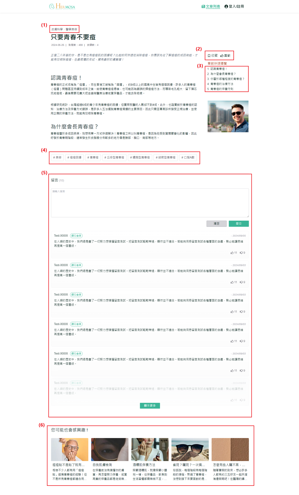
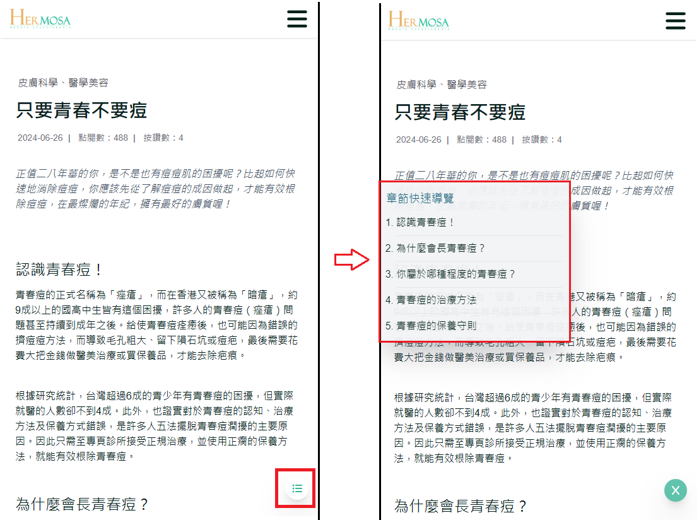

# 查看文章内容

当使用者点击文章卡片后，将进入文章详情页面。在此页面，使用者可以浏览完整的文章内容，并进行多种操作，如按分类搜索、收藏文章、点赞、快速导览章节、留言互动及查看推荐文章等。

## 操作说明

### 桌面版操作步骤

1. **点击主类**：点击主类 (例如：皮肤科学) 后，系统将重定向至该主类别的文章列表页，显示该分类下的所有文章。
2. **点击收藏与点赞**：点击收藏或点赞按钮时，若使用者尚未登录，系统会弹出登录提示，确认后将跳转至登录页面。登录成功后，系统将自动返回文章详情页，并立即执行收藏或点赞操作。
3. **章节快速导览**：点击章节快速导览中的段落标题，页面将自动滚动至对应的文章段落，方便使用者快速浏览长篇内容。
4. **点击关键词**：点击文章中的关键词，系统将跳转至搜索结果页，并显示所有与该关键词相关的文章。
5. **留言功能**：使用者可以在留言区输入评论，并有清空内容的选项。默认显示5条留言，点击「显示全部」后可查看所有留言，让使用者与其他读者进行互动。
6. **推荐文章**：文章底部会显示与该文章相关的推荐文章卡片。使用者可以点击卡片，直接进入相关文章的详情页，进一步提升网站的内容流转和使用者停留时间。
   

### 移动版操作步骤

- **章节快速导览**：点击右下方的菜单 ICON 来开启或关闭章节快速导览功能，使用者可以通过点击对应的章节标题快速跳至文章相应位置。
- **其他操作**：与桌面版一致，移动版也支持收藏、点赞、留言、推荐文章等功能，确保在不同设备上的使用体验一致。
  

### 补充说明

- **桌面与移动版功能一致性**：无论是桌面还是移动设备，使用者都能进行主类和子分类切换、收藏和点赞文章、章节快速导览、留言和查看推荐文章等操作。两个版本的功能一致，但操作方式会根据设备有所调整，确保流畅的用户体验。
