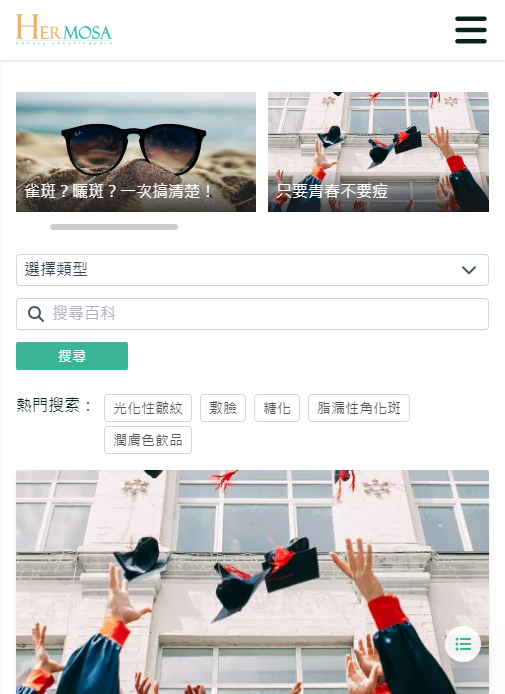

# 推荐热门文章

当使用者通过导航列点击 "文章列表" 进入页面时，最上方区域会显示推荐热门文章卡片。此区域帮助使用者快速浏览最受欢迎的文章，并能轻松进入文章详情页。

## 操作说明

### 桌面版操作步骤

- **鼠标移入效果**：当使用者在桌面版中鼠标移入文章卡片时，卡片上会显示更多文章信息，包括标题、详情等等（红框处显示）。
- **点击文章卡片**：点击卡片后，会直接跳转至该文章的详情页。
  

### 移动版操作步骤

- **直接显示文章标题**：在移动设备上，文章卡片会直接显示标题，没有鼠标移入的效果，但文章卡片拥有左右滑动的特性。
- **点击文章卡片**：与桌面版相同，点击卡片后会直接进入文章详情页。
  
