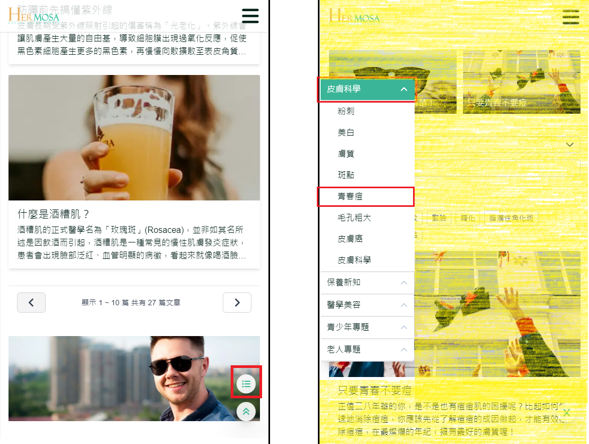

# 按分类搜索文章

当使用者通过导航列点击 "文章列表" 进入页面时，下方的左侧边栏区域会显示主类(章)与子分类(节)的文章，帮助使用者快速依照分类搜索文章，并能轻松进入文章详情页。

## 操作说明

### 桌面版操作步骤

- **点击侧边栏主类**：点击主类 (例: 皮肤科学) 后，右侧文章卡片会即时更新，显示该主类下的所有文章。
- **点击侧边栏子分类**：点击子分类 (例: 粉刺) 后，右侧文章卡片会更新为该子分类的文章列表。
- **鼠标移入文章卡片效果**：当鼠标移入文章卡片时，卡片的标题将进行颜色变化（例如：变成黄色），告知使用者当前选中的文章。
- **点击文章卡片**：点击卡片后，会直接跳转至该文章的详情页。
- **点击分页功能**：当文章列表超过 10 篇时，系统会自动显示分页功能，使用者可以通过点击页码或左右箭头来切换页面。
  
  

### 移动版操作步骤

- **点击右侧菜单ICON**：点击右下方的菜单 ICON 可以开启或关闭侧边栏功能，用户可以选择主类或子分类进行筛选。
- **点击侧边栏主类**：选择主类 (例: 皮肤科学) 后，右侧文章卡片会自动更新为该主类下的文章。
- **点击侧边栏子分类**：点击子分类 (例: 粉刺) 后，右侧文章卡片将显示该子分类下的文章。
- **点击侧边栏外部空白区域**：点击侧边栏右侧的黄色区域可以快速关闭侧边栏。
- **点击文章卡片**：点击文章卡片将跳转至该文章的详情页。
- **点击分页功能**：当文章列表超过 10 篇时，会自动显示分页功能，您可以通过点击左右箭头来进行页面切换。
  

### 补充说明

- **桌面与移动版功能一致性**：桌面版与移动版在功能上保持一致，均提供主类和子分类筛选以及分页功能，但在视觉呈现和操作方式上有些许差异，桌面版具备鼠标移入效果，而移动版则通过菜单切换来展现侧边栏。
- **分页体验**：分页功能自动出现时，确保切换速度快且不会卡顿，以提升使用者的流畅体验。
