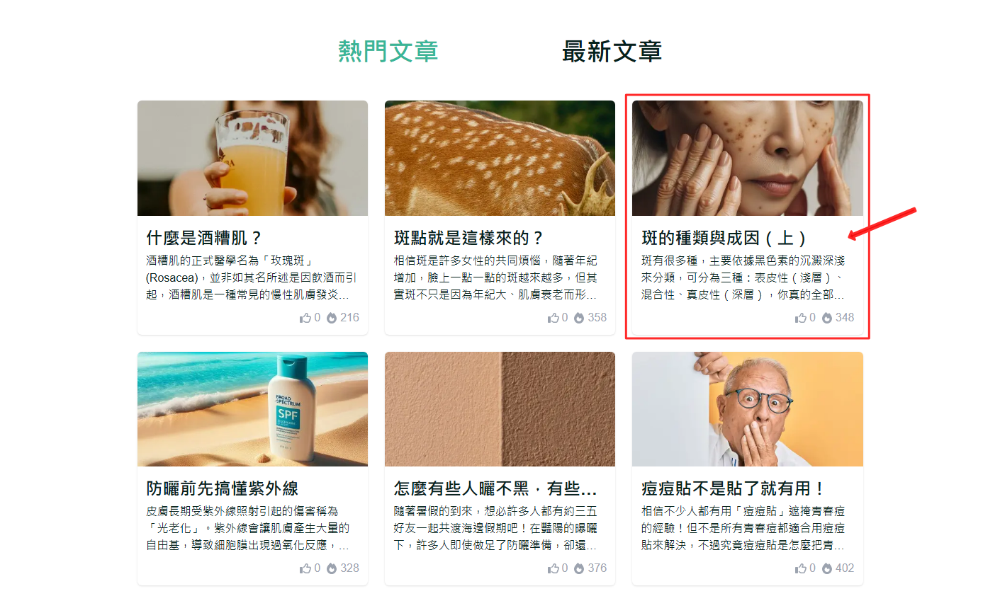
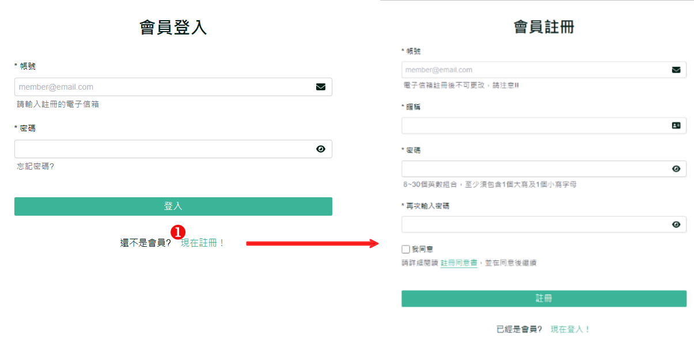
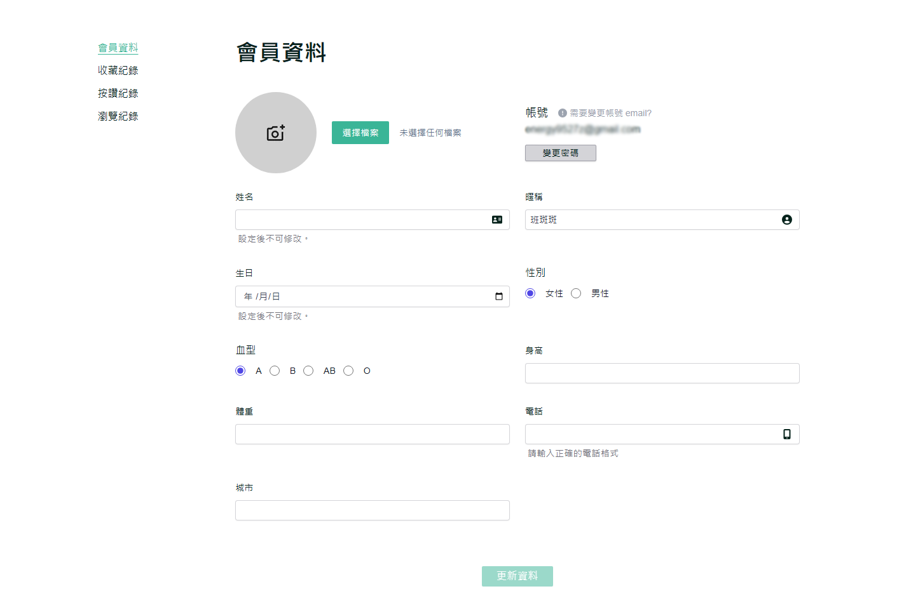

# 如何使用美容百科网站?

美容百科网站为用户提供了丰富的美容资讯，并且可以轻松搜索、浏览文章、收藏内容，还提供个性化的会员功能。这些功能帮助用户快速获取最新、最热门的美容资讯。

## 使用指南：

- 网站导航：
  - 首页导航列会显示主要的网站功能区，包括文章列表、会员管理等。
    
  - 点击任一导航选项，即可跳转到相应页面。
    
- 搜索功能：
  - 在文章列表以及搜索结果页均有一个搜索栏。您可以输入关键词，搜索与美容相关的文章或内容。
    
  - 搜索时若有对应关键词则会显示在下方(1)，也可选择搜索段落类型(2)，可通过进一步筛选来缩小范围。
    
- 热门文章与推荐内容：
  - 首页会显示当前最热门的美容文章和系统推荐(登录时)的内容。您可以随时点击文章进入详情页面进行阅读。
    
- 登录/注册：
  - 您可以操作会员登录，或者点击(1)现在注册，进行会员注册流程。
    
- 会员专区：
  - 您可以在会员中心注册以及登录会员后，查看个人信息、收藏记录、喜爱文章，并编辑个人资料及密码。
    

## 注意事项：

- 美容百科网站支持桌面和移动设备，界面会根据不同设备进行自适应调整。
- 记得注册成为会员，获得更多个性化功能和文章推荐。
