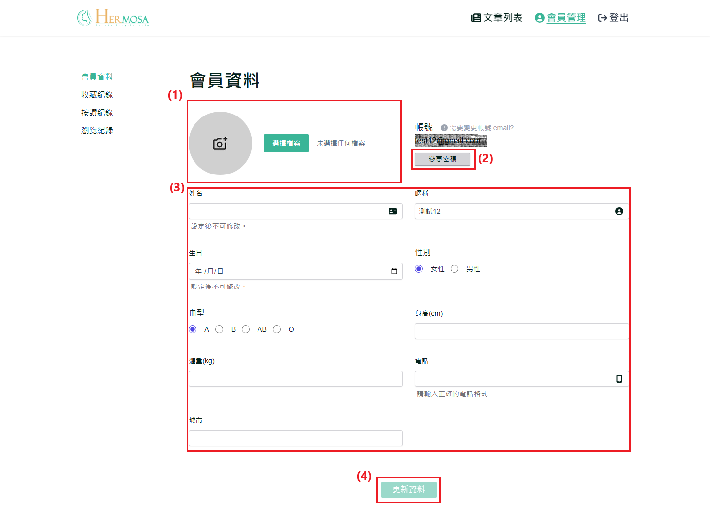
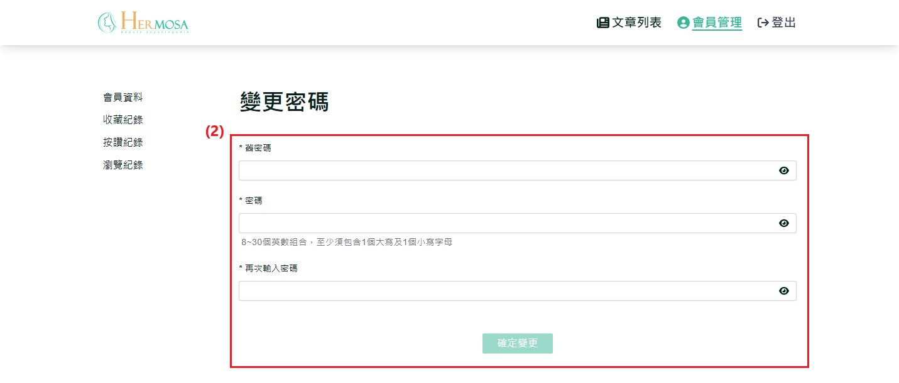
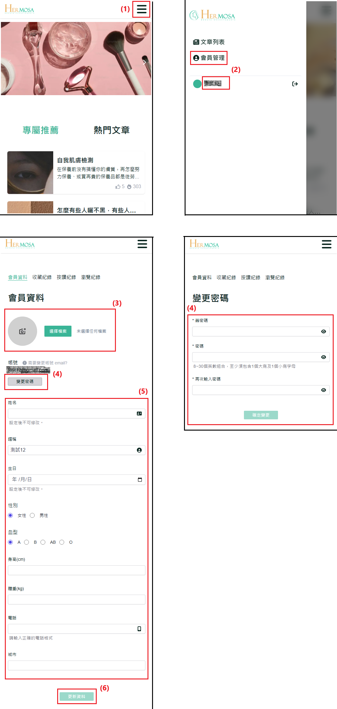

# 修改个人资料和密码

使用者可以通过个人资料页面更新个人信息和修改密码，以提升账号的安全性。此功能允许使用者随时管理自己的资料，确保信息的正确性与账号的安全。

## 操作说明

### 桌面版操作步骤

**完成注册与登录操作**：依照 [注册流程](./register-new-account.md#桌面版操作步骤) 完成注册后，再进行 [登录](./login-logout-process.md#桌面版操作步骤)。

1. **替换个人头像图片**：点击个人头像或“选择文件”按钮，选择一张图片作为个人头像（图片限制：2MB 以下，格式必须为 .jpg 或 .png）。
2. **变更密码**：点击“变更密码”按钮，进入变更密码页。首先需验证旧密码，并确保新密码与旧密码不同且两次输入的新密码相同。成功修改后，系统将强制登出，使用者需重新登录。
3. **填写个人资料**：更新或填写个人资料，包括姓名、昵称、生日、身高、体重等信息。
4. **点击“更新资料”**：完成资料更新后，点击“更新资料”按钮以保存更改。若未修改任何内容，按钮将保持不可点击状态。
   
   

### 移动版操作步骤

**完成注册与登录操作**：依照 [注册流程](./register-new-account.md#移动版操作步骤) 完成注册后，再进行 [登录](./login-logout-process.md#移动版操作步骤)。

1. **点击右上角菜单 ICON**：点击右上角的菜单按钮以开启导航列。
2. **点击“会员管理”或会员昵称**：在导航列中点击“会员管理”或直接点击会员昵称，进入个人资料页面。
3. **替换个人头像图片**：点击个人头像或“选择文件”按钮，选择图片作为个人头像（图片限制：2MB 以下，格式必须为 .jpg 或 .png）。
4. **变更密码**：点击“变更密码”按钮进入密码修改页面，需验证旧密码，并确保新密码与旧密码不同，且两次输入的新密码需相符。成功修改后，系统将强制登出，需重新登录。
5. **填写个人资料**：更新或填写个人资料，包括姓名、昵称、生日、身高、体重等信息。
6. **点击“更新资料”**：确认资料后，点击“更新资料”按钮保存变更。若未进行任何修改，按钮将保持不可点击状态。
   

### 补充说明

- **完善资料与个人资料更新功能的一致性**：无论是在首次登录后 [完善资料](./first_login_more_account.md)，还是后续的个人[资料更新](./edit-profile-and-password.md)，两者功能基本一致，仅页面展示有所不同。
