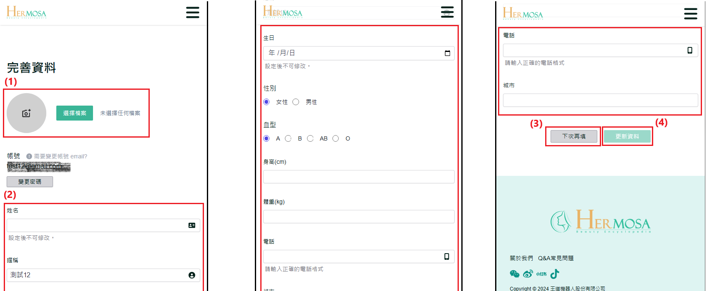

# 首次登录完善资料

当使用者首次登录美容百科网站时，系统将引导其至「完善资料」页面。在此页面，使用者可以更新或填写个人基本资料，如姓名、联系方式等。此步骤帮助系统更好地提供个性化服务，确保账户资料的完整性。使用者可以选择立即填写资料，或者跳过此步骤并在稍后更新。

## 操作说明

### 桌面版操作步骤

**完成注册与登录操作**：依照 [注册流程](./register-new-account.md#桌面版操作步骤) 完成注册后，再进行 [登录](./login-logout-process.md#桌面版操作步骤)。若为首次登录，系统将引导至完善资料页面。

1. **替换个人头像图片**：在完善资料页面中，点击个人头像或“选择文件”按钮，选择一张图片作为个人头像使用（图片限制：大小不超过 2MB，格式必须为 .jpg 或 .png）。
2. **填写个人资料**：在该页面更新或填写个人资料，包括姓名、昵称、生日、身高、体重等信息。
3. **点击「下次再填」**：若不希望立即更新资料，点击“下次再填”按钮，系统将跳转至首页。未来再登录时将不再进入完善资料页面。
4. **点击「更新资料」**：完成资料更新后，点击“更新资料”按钮以保存变更。如果未修改任何内容，按钮将保持不可点击状态。
   

### 移动版操作步骤

**完成注册与登录操作**：依照 [注册流程](./register-new-account.md#移动版操作步骤) 完成注册后，再进行 [登录](./login-logout-process.md#移动版操作步骤)。若为首次登录，系统将引导至完善资料页面。

1. **替换个人头像图片**：在完善资料页面中，点击个人头像或“选择文件”按钮，选择一张图片作为个人头像使用（图片限制：大小不超过 2MB，格式必须为 .jpg 或 .png）。
2. **填写个人资料**：在该页面更新或填写个人资料，包括姓名、昵称、生日、身高、体重等信息。
3. **点击「下次再填」**：若不希望立即更新资料，点击“下次再填”按钮，系统将跳转至首页。未来再登录时将不再进入完善资料页面。
4. **点击「更新资料」**：完成资料更新后，点击“更新资料”按钮以保存变更。如果未修改任何内容，按钮将保持不可点击状态。
   

### 补充说明

- **完善资料与个人资料更新功能的一致性**：无论是在首次登录后 [完善资料](./first_login_more_account.md)，还是后续的个人[资料更新](./edit-profile-and-password.md)，两者功能基本一致，仅页面展示有所不同。
