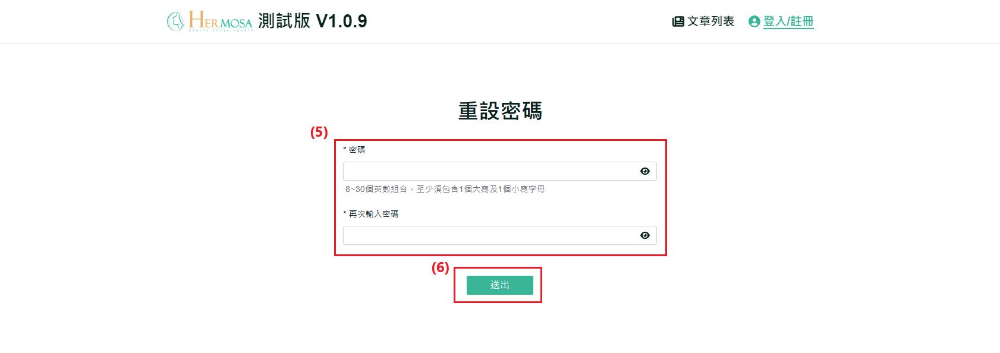

# 忘记密码流程

当使用者忘记账号密码时，系统提供了忘记密码的功能。使用者可以通过电子邮件找回密码，按照步骤完成密码重设，从而安全地恢复对账号的访问。

## 操作说明

### 桌面版操作步骤

1. **点击「忘记密码」**：在会员登录页面中，点击密码栏位下方的「忘记密码」链接，进入忘记密码页面。
   
2. **填写会员账号**：输入有效的电子邮件地址，系统将自动验证邮箱格式是否正确。
3. **点击「发送验证」**：点击「发送验证」按钮后，系统会检查该电子邮件是否存在于数据库中。无论成功或失败，系统将通知使用者。发送成功后，电子邮件地址将无法修改，且在60秒内不可再次请求发送验证信。
   
   
4. **点击信件「点我重设密码」**：前往您电子邮件收件夹（如 Google 信箱），找到来自系统的重设密码信件，并点击信中的「点我重设密码」链接，进入重设密码页面。
    
   
5. **填写新密码**：新密码需符合指定格式，并且两次输入的新密码必须一致。
6. **点击「送出」**：确认两次输入的新密码一致后，点击「送出」按钮完成重设。成功重设密码后，系统将自动重定向登录页面，使用者需再次登录。
   

### 移动版操作步骤

与桌面版功能一致，主要差异在于移动端界面自适应不同。

### 补充说明

- **桌面与移动版功能一致性**：无论是桌面还是移动设备，使用者都能进行忘记密码等操作。两个版本的功能一致，但操作方式会根据设备有所调整，确保流畅的用户体验。
