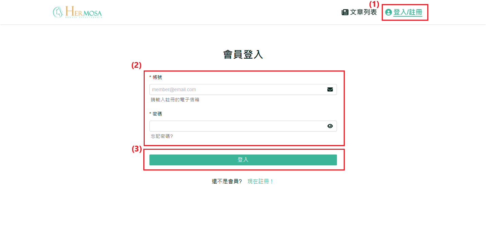

# 登录和登出流程

此功能为使用者提供了登录会员账号及登出的完整流程。登录后，使用者可以访问更多个性化功能，例如文章收藏、个人资料编辑等。登出功能确保使用者的账号安全，尤其是在公共电脑或其他共享设备上使用时。

## 操作说明

### 桌面版操作步骤

1. **点击「注册/登录」**：在网站的导航列中点击「注册/登录」按钮，将跳转至登录页面。
2. **填写个人会员账号与密码**：在登录页面上，输入您的有效电子邮件地址和密码。
3. **提交登录**：确认所有资料无误后，点击「登录」按钮。若登录成功，系统将显示提示并自动跳转至首页或是点击登录时的页面；如果首次登录，则会跳转至完善资料页，用户可以选择填写更多个人信息或跳过。
   
4. **点击「登出」**：成功登录后，使用者可以在网站的导航列中找到「登出」按钮。点击后，系统将弹出确认窗口，再次点击确认即可执行登出，确保使用者账号的安全性。
   
   

### 移动版操作步骤

1. **点击右上角菜单 ICON**：开启导航列功能。
2. **点击「注册/登录」**：在网站的导航列中点击「注册/登录」按钮，将跳转至登录页面。
3. **填写个人会员账号与密码**：在登录页面上，输入您的有效电子邮件地址和密码。
4. **提交登录**：确认所有资料无误后，点击「登录」按钮。若登录成功，系统将显示提示并自动跳转至首页或是点击登录时的页面；如果首次登录，则会跳转至完善资料页，用户可以选择填写更多个人信息或跳过。
   
5. **点击「登出」**：成功登录后，使用者可以在移动版导航列中找到「登出」符号按钮。点击后，系统将弹出确认窗口，再次点击确认即可执行登出，确保使用者账号的安全性。
   
