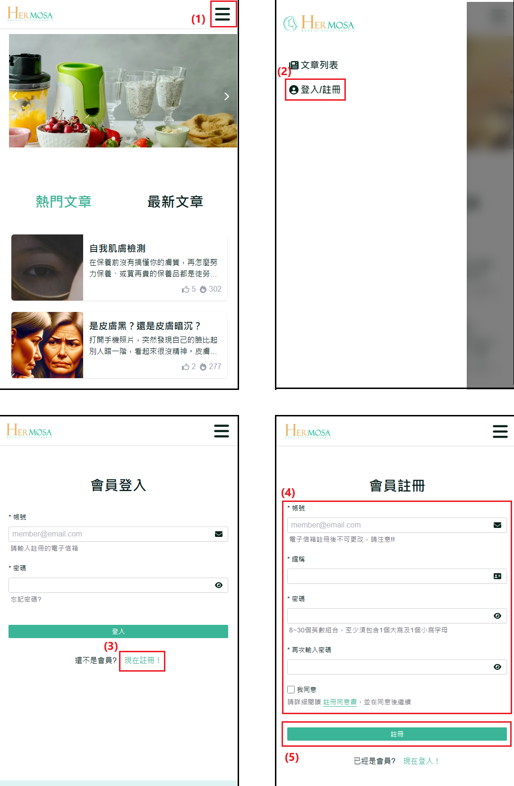

# 注册新账号

此功能允许新用户在美容百科网站上注册账号，并提供现有用户登录的途径。通过注册，用户可以解锁更多个性化功能，例如文章收藏、编辑个人资料等，提升使用体验。

## 操作说明

### 桌面版操作步骤

1. **点击「注册/登录」**：在网站的导航列中点击「注册/登录」按钮，将跳转至登录页面。
2. **点击「现在注册」**：在登录页面上，点击「现在注册」按钮，进入注册页面。
3. **填写注册资料**：在注册页面上，输入您的有效电子邮件地址、昵称、设置密码，并在密码栏中再次确认密码。请仔细阅读注册同意书，并勾选「我同意」以完成同意程序。
4. **提交注册**：确认所有资料无误后，点击「注册」按钮。系统将提示账号注册成功，并自动重定向至登录页面。用户可使用新注册的账号与密码登录。
     
   

### 移动版操作步骤

1. **点击右上角菜单 ICON**：开启导航列功能。
2. **点击「注册/登录」**：在网站的导航列中点击「注册/登录」按钮，将跳转至登录页面。
3. **点击「现在注册」**：在登录页面上，点击「现在注册」按钮，进入注册页面。
4. **填写注册资料**：在注册页面上，输入您的有效电子邮件地址、昵称、设置密码，并在密码栏中再次确认密码。请仔细阅读注册同意书，并勾选「我同意」以完成同意程序。
5. **提交注册**：确认所有资料无误后，点击「注册」按钮。系统将提示账号注册成功，并自动重定向至登录页面。用户可使用新注册的账号与密码登录。
   
