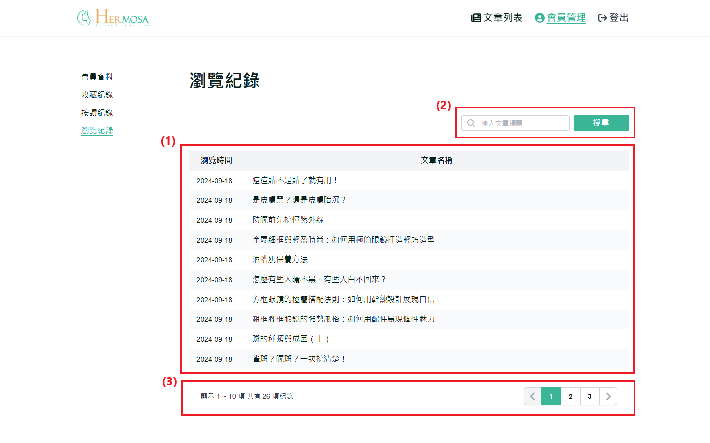

# 查看浏览记录

使用者可以通过浏览记录功能查看过去访问过的文章。这使得使用者可以快速回到先前阅读的内容，方便再次查看有价值的信息。

## 操作说明

### 桌面版操作步骤

1. **显示已浏览文章列表**：显示使用者已浏览的文章列表。使用者可以通过点击文章标题，直接前往该文章的详情页面。
2. **搜索已浏览文章功能**：使用者可以在搜索栏输入关键词，按下「Enter」或点击「搜索」按钮，系统会根据文章标题进行筛选，显示符合搜索条件的已浏览文章列表。
3. **分页功能**：当已浏览的文章超过 10 篇时，系统会自动启用分页功能。使用者可以通过点击页码或使用左右箭头来切换不同页面的文章列表。
   

### 移动版操作步骤

与桌面版功能一致，主要差异在于移动端界面自适应不同。
