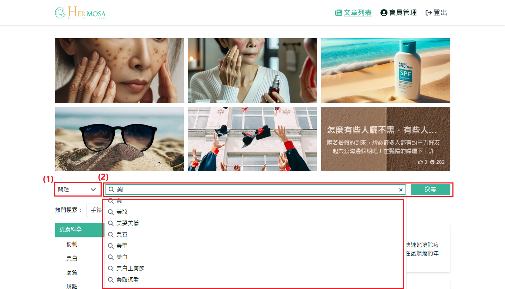
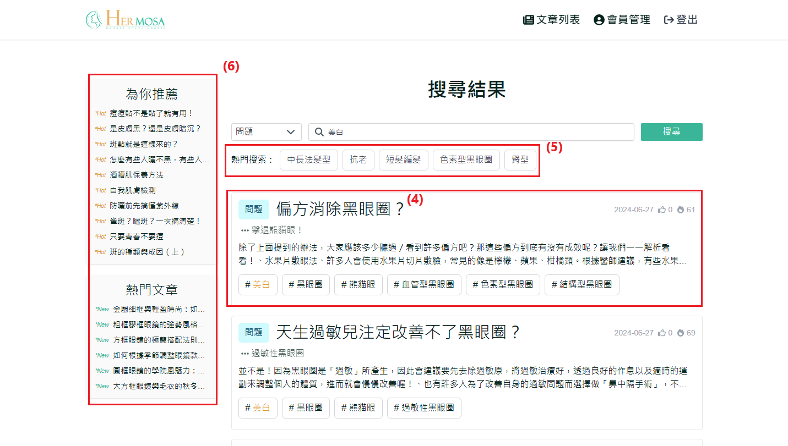

# 关键词与全站搜索

使用者可以通过输入关键词，进行全站范围内的搜索，系统将显示所有与该关键词相关的文章和内容。并支持使用者根据特定的问题类型进行筛选搜索，系统会根据该类型提供相关文章的搜索结果，使搜索更有针对性，节省时间。

## 操作说明

### 桌面版操作步骤

1. **选择问题类型**：点击「选择类型」菜单，选择其一 "问题"、"方法"、"原因"、"建议"，不选择则默认全站搜索。
2. **输入关键词取得关键词列表**：在文章列表或搜索结果页面，点击搜索框并输入「美」后，系统会显示相关关键词列表。使用者可以通过方向键上下移动并按下 Enter 键，或直接使用鼠标点击进行关键词搜索，将重定向至 搜索结果页面。
3. **输入关键词进行全站搜索**：在文章列表或搜索结果页面，点击搜索框并输入「美白」后，按下 Enter 键或点击搜索按钮，系统将重定向至 搜索结果页面 进行全站搜索。
   
4. **显示搜索结果相关文章**：显示使用者输入关键词搜索后的文章列表。使用者可以通过点击文章区块，直接前往该文章的详情页面。
5. **显示热门关键词**：显示当前热门关键词列表，可直接点击进行关键词搜索。
6. **显示推荐文章区块**：显示当前推荐文章列表，如果登录状态下则会是(推荐/热门)，未登录则是(热门/最新)，使用者可以通过点击文章区块，直接前往该文章的详情页面。
   

### 移动版操作步骤

与桌面版功能一致，主要差异在于移动端界面自适应不同。
